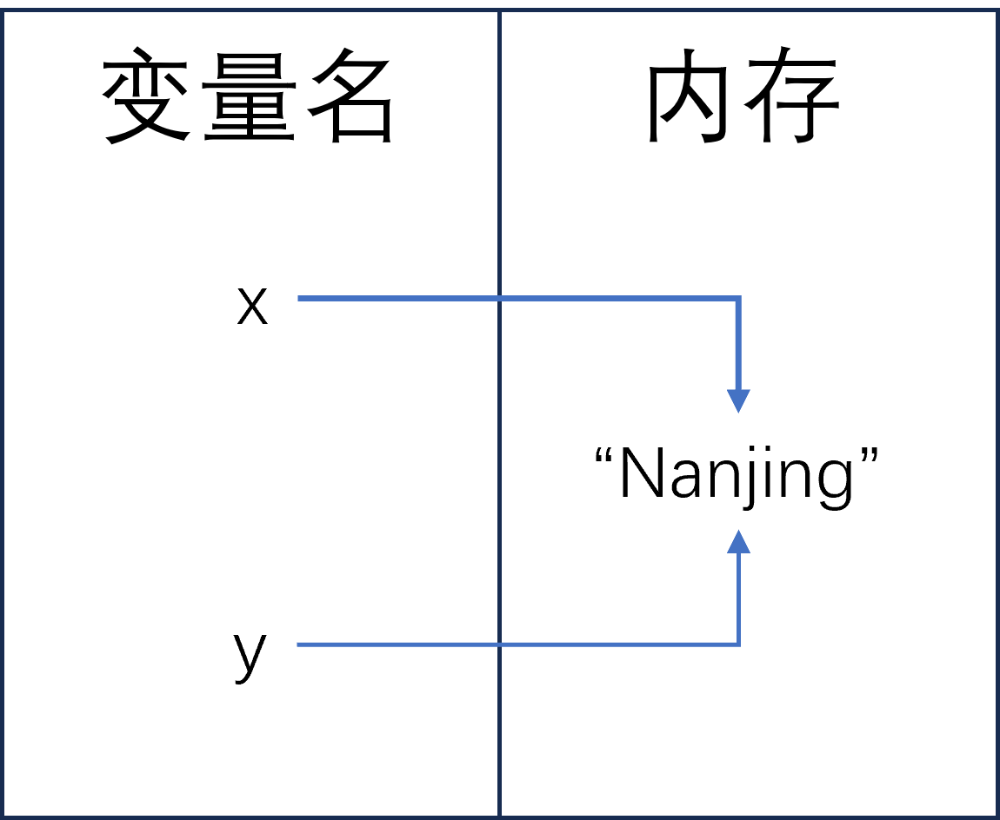
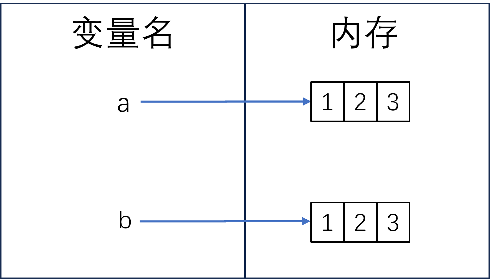
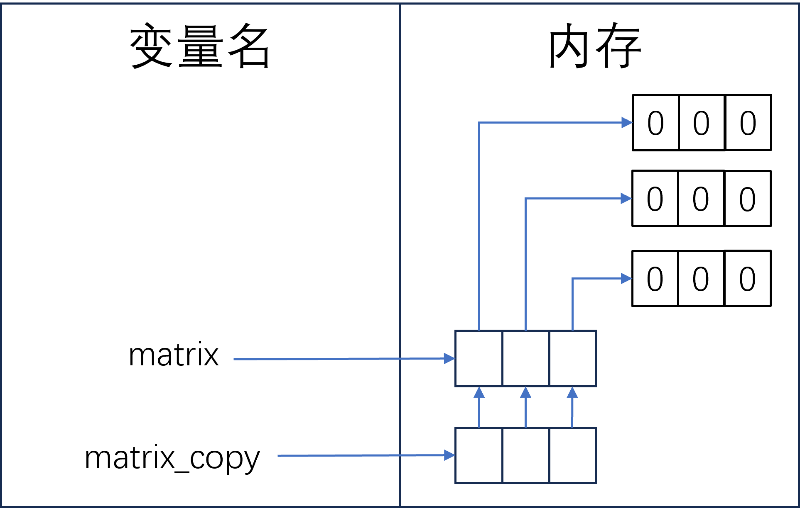
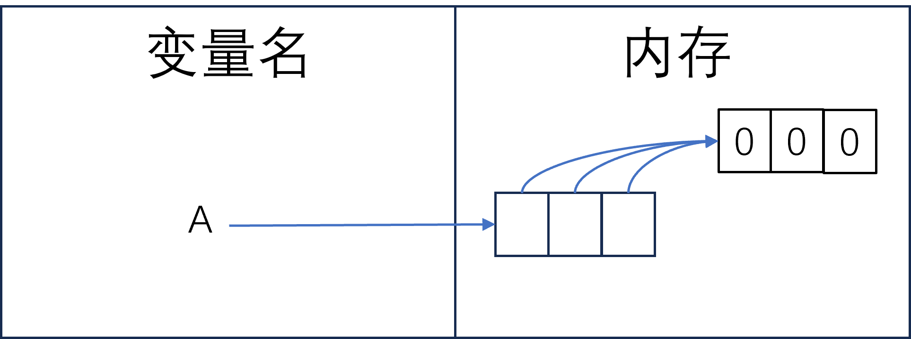
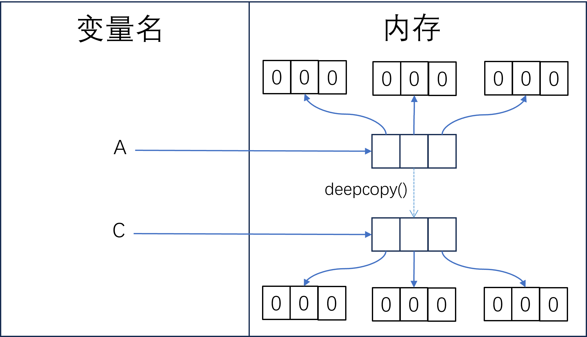

# 【Python教程】《零基础入门学习Python》最新版（完结撒花🎉）
[B站视频链接](https://www.bilibili.com/video/BV1c4411e77t/)

## 前言
本文只是作为一个随手写的笔记，在语言上面没有过多的推敲，只是为了看懂，因此就会有不少的语病，请谅解！
### 编写代码时的注意事项
编写代码时要注意中英文标点符号，除了字符串中可以用中文标点，其他**涉及到代码的标点必须使用英文标点**。相同代码块下的语句中出现的空格不影响编译，只是为了美观，你可以更具自己的喜好选择要不要加空格。

本文编写的代码大部分可以直接运行在python安装的IDLE中，也可以使用Microsoft visual studio code和Microsoft visual studio等其他软件编写。在其他第三方IDE中，可能不会像官方的IDLE中访问之后就能直接返回结果，这个时候建议使用`print()`将结果打印出来。


## 变量

**变量：只是一个名字，不是盒子**

### 一、创建变量
很简单，用赋值运算符就可以完成
```python
#使用语法（仅表示语法结构，代码是不能运行在idle中的）
变量名 = 值（内容）

#示例
x = 3
```

其中“=”为赋值运算符，将等号右边的值赋给等号左边的变量名
**(注：变量名不可以以数字开头，且区分大小写；python3以上变量名支持中文)**

### 二、访问变量

直接打变量名就好

### 三、调换变量值

*1、用中间变量*

通过中间变量来实现变量值的调换，代码如下：

```python
x = 3
y = 2
z = x
x = y
y = z

#通过元组（后续会有介绍）来调换变量值，代码如下：
x,y = y,x
```

## 字符串（第一部分）

**可以理解为就是文本**。用单引号、双引号、三引号包裹起来 **（注：引号必须成对使用，且不能混用(单引号对双引号之类的)，有时需要及时变通；看如下例子）**

```python
#以下是错误的代码
print('Let's go!') #Let`s中的缩写会被程序认为 “Let”是字符串，而“s go！'”是一个无头的字符串
#以下是正确的代码
print("let`s go!") #这是需要将外面的单引号变为双引号，可以防止程序出现歧义
```

### 1、转义字符

如果一个文本中既有双引号又有单引号，这是推荐使用转义字符来实现

例如，用python打印"Life id short,let`s learn Python"，该文本中既有单引号又有双引号，需要用到转义字符，代码如下

```python
print('\"Life is short,let\`s learn Python\"') #用转义字符能让程序识别出单引号和双引号，此时外围的引号只要一样且成对即可
```

由上述代码可知，转义字符用\\+后缀来表示

其他的转义字符如下

| 符号 |       说明       |
| :---: | :---------------: |
|  \\\  |    反斜杠（\）    |
|  \\'  |    单引号（'）    |
|  \\"  |    双引号（"）    |
|  \\a  |    响铃（BEL）    |
|  \\b  |   退格符（BS）   |
|  \\n  |   换行符（LS）   |
|  \\t  | 水平制表符（TAB） |
|  \\v  | 垂直制表符（VT） |
|  \\r  |   回车符（CR）   |
|  \\f  |   换页符（FF）   |
| \\ooo |   ooo为八进制数   |
| \\xhh |  hh为十六进制数  |

### 2、原始字符串

总所周知，文件路径中含有反斜杠，而反斜杠后带的字母刚好是转义字符时，程序也依然会按照转义字符去编译，这时为了不产生歧义需要用到原始字符串，来让程序不对字符串中的转义符进行解释,即在字符串前面加上一个小写 `r`。例如

```python
print("D:\three\two\one\now") #文件路径中的反斜杠和后面带着的字母刚好组成反斜杠，让程序认为是转义字符

#正确表达路径方式如下
print("D:\\three\\two\\one\\now") #字符串中含有少量的反斜杠时，可以选择增加一个反斜杠来使其达到目的 
print(r"D:\three\two\one\now") #加上r说明该字符串就是原始字符串，程序不会对其中的转义符进行解释
```

**注：使用反斜杠时，注意不能在字符串的末尾，字符串的末尾出现反斜杠会让程序认为这还没有结束！**

### 3、长字符串

如果字符串的内容需要换行表示，此前用转义字符中的换行符 `\n`来实现，到此可用到长字符串来实现。长字符串用 `'''`或 `"""`表示（引号必须成对使用），例如：

```python
poetry = """
静夜思 李白
床前明月光，
疑是地上霜。
举头望明月，
低头思故乡。
"""
```

从头到尾，没有使用换行符，即可实现换行。

### 4、字符串的加法和乘法

字符串的加法和数值的加法有区别，例如

```python
a = "520"
b = "1314"
print(a+b) #此时变量a和b均为字符串，打印出的结果为'5201314',即对字符串进行了拼接
```

乘法就是对字符串重复打印，可自行测试如下代码：

```python
print("我今天一定要好好学习"*3000)
print("我今天一定要好好学习\n"*3000)
```

## 数字类型

### 整数

就是你学到的整数，和你之前学的整数没有任何区别，_真的没必要说_

### 浮点数

可以粗略理解为小数。为什么说粗略理解为小数呢？可以测试先看如下代码

```python
a = 0.1
b = 0.2
print(a+b)
```

如果不死心的同学可以尝试如下代码：

```
a = 0.1
b = 0.2
0.3 == a+b
```

不出意外的话，打印的结果不是0.3，而是0.30000000000000004；返回的值也是false。这是因为python和C语言一样，采用IEEE754的标准来存储浮点数，故浮点数会有误差。

#### 如何精确的计算浮点数？

想要精确的计算浮点数需要用到decimal模块。此模块程序不是默认启用的，需要导入 `import decimal`。然后通过该模块，计算浮点数。具体代码如下：

```python
import decimal
a = decimal.Decimal('0.1') #括号内为字符串
b = decimal.Decimal('0.2')
print(a+b)
```

此时，计算的结果就是0.3

### 布尔类型
结果为 `True` 或 `False` 的数值类型。可用函数 `bool()` 进行检测。代码如下：
```python
bool(True)
bool(False)
bool("520")
bool(520)
bool("False")
bool("1")
bool("0")
bool(0)
bool(0.0)
bool({})
bool("")
```
由上述代码返回的值总结出，返回值为`False`的情景为：

+ 1、定义为False的对象：None和False

+ 2、值为0的数字类型：包括整数，浮点数，复数等等

+ 3、空的序列和集合：`""`、`()`、`[]`、`{}`、`range(0)`、`set(0)`

下面看如下代码：
```python
1 == True
0 == False
```
返回值都为True，则上述等式成立，换言之布尔类型就是特殊的整数类型，因此布尔类型也可以参与一些运算：
```python
True + False
True - False
True * False
True / False #这一行会报错，0不能做为除数
```

### 复数

和学到的复数是一样的，分为实部和虚部，但在python中虚部的i用j表示，故python中复数表示为 `1+2j`

#### 获取一个复数的实部和虚部

在python中能够通过代码来获取复数的实部和虚部，代码如下

```python
x = 1+2j
x.real #获取复数x的实部
x.imag #获取复数x的虚部
```

## 数字运算

### 数字运算表

|      操作      |               结果               |
| :------------: | :------------------------------: |
|      x+y      |            x加y的结果            |
|      x-y      |            x减y的结果            |
|      x*y      |            x乘y的结果            |
|      x/y      |           x除以y的结果           |
|      x//y      |     x除以y的结果（地板除¹）     |
|      x%y      |           x除以y的余数           |
|       -x       |            x的相反数            |
|       +x       |              x本身              |
|     abs(x)     |      x的绝对值，或复数的模       |
|     int(x)     |   将x转换成整数（丢掉小数部分）    |
|    float(x)    |         将x转换成浮点数         |
| complex(re,im)² | 返回一个复数，re是实部，im是虚部 |
| c.conjugate() |         返回c的共轭复数         |
|  divmod(x,y)  |        返回（x//y，x%y）        |
|    pow(x,y)³    |           计算x的y次方           |
|      x**y      |           计算x的y次方           |

+ 地板除：两数所求得的商进行**向下取整**。以下是两个例子，含有正数和负数的情况，地板除为向下取整，而不是直接去除小数部分：

```python
a,b = 3,2
print(a//b) #返回值应该是1
x,y = -3,2
print(x//y) #返回值应该是-2
```


+ complex(re,im)：该函数输入的数据要么以整数或浮点数虚实部分开传入，要么就直接输入（也可以用字符串传入,但在字符串中不能出现空格）整个复数。代码如下：
```python
#错误的代码
complex("1","2")
complex("1 + 2j")
#正确的代码
complex(1,2)
complex("1+2j")
complex(1+2j)
```

+ pow(x,y)：通常情况下该函数和 `x**y` 没有区别，但是该函数支持输入第三个参数。该参数表示将幂运算的结果与此参数进行取余运算。可以尝试如下代码
```python
pow(2,3,5) # 输出的结果应该是3（为2的3次方后除以5的余数）
```


### 逻辑运算符
**和、且、非**：和高中学的一样的
| 运算符 | 含义 |
|:---:|:---:|
| and | 符号左右两边同时为True |
| or | 符号左右两边满足一个True |
| not | 如果操作数为True，返回False；如果操作数为False，返回True |

#### and（和/与）
使用方式如下：
```python
3 < 4 and 7 > 5  #返回True
3 > 4 and 7 > 5  #返回False
3 > 4 and 7 < 5  #返回False
```
判断真假的式子放在and两边

#### or（且/或）
使用方式和`and`相差不大：
```python
3 < 4 or 7 > 5  #返回True
3 > 4 or 7 > 5  #返回True
3 > 4 or 7 < 5  #返回False
```
判断真假的式子放在`or`两边

#### not（非）
使用方式与`and`和`or`有区别，看如下代码：
```python
not True  #返回False
not False  #返回True
not 520  #返回False
not 0 #返回True
```
判断真假的式子放在`not`后面

### 短路逻辑
Python中能对任何对象做真值测试（测试该对象的布尔值）。数值作为对象也能参与真值测试，请看如下代码：
```python
3 and 4 #返回4
4 or 5 #返回4
"nuist" and "njtech"  #返回'njtech'
"njtech" and 520  #返回'520'
```
**短路逻辑核心思想**：从左往右，只有当第一个操作数的值无法确定逻辑运算的结果时，才对第二个操作数进行求值。或者是返回直接影响最后结果的对象。逻辑运算符是遵循短路逻辑的。

1、`and`：当左右两边的对象都为`True`才能得出结果`True`，此时影响最后结果的值为后一个对象；当左边为`True`,右边为`False`时，此时影响最后结果的值为后一个对象，则输出后一个对象的值；当左边为`False`时，由于`and`中出现`False`即返回`False`,换言之此时的第一个对象就能判断结果，则输出第一个对象。
```python
3 and 4 #返回4
3 and 0 #返回0
0 and 3 #返回0
0 and 0 #返回0
```
2、`or`：（和`and`相反）逻辑是一样的，只不过是判断的是false
```python
3 or 4 #返回3
3 or 0 #返回3
0 or 3 #返回3
0 or 0 #返回0
```

### 运算符的优先级
运算表达式执行的先后顺序，和四则运算顺序类似，小括号最高级，编写程序时想要谁先算可以加小括号来解决问题

#### 运算优先级顺序表
_注：优先级数越高，越先被计算_
| 优先级 | 运算符 | 描述 |
|:-----:|:------:|:----:|
|1|`lambda`|Lambda表达式
|2|if-else|条件表达式
|3|`or`|布尔“或”
|4|`and`|布尔“与”
|5|`not x`|布尔“非”
|6|`in`,`not in`,`is`,`is not`,`<`,`>`,`<=`,`>=`,`==`,`!=`|成员测试，同一性测试，比较
|7|`\|`|按位或
|8|`^`|按位异或
|9|`&`|按位与
|10|<<,>>|移位
|11|+,-|加法，减法
|12|*,@,/,//,%|乘法，矩阵乘法，除法，地板除，取余数
|13|+x,-x,~x|正号，负号，按位翻转
|14|**|指数|
|15|await x|Await表达式|
|16|x[index],x[index:index],x(arguments...),x.attrubute|下标，切片，函数调用，属性引用|
|17|(expressions...),[expressions...],{key:value...},{expressions...}|绑定或元组显示，列表显示,字典显示，集合显示|

## 绘制流程图
开始编写代码前需要了解自己的代码要完成什么事情，绘制出流程图，帮助以后很好的编写代码。

*和高中学的流程图一样的*

## 分支和循环
### 分支结构
在python中，分支结构通过`if`语句来实现，python中一共有5种`if`语句。
#### 一、判断条件成立，执行包含代码（块）
语法结构如下
```python
#示例（仅表示语法结构，代码是不能运行在idle中的）
if conditions:
    statement(s)
    statement(s)
#例如
if 1>0:
    print("1是大于0的")

#例如（if后条件为False）
if 1<0:
    print("打印这段话")
```
上述示例中，if后面的`conditions`应该为一个可以判断布尔类型的对象，这样程序才能继续运行。在python中，通过缩进来区分代码块。上述例子中`statement(s)`前面（4个空格）的缩进表示一个代码块，且包含在`if conditions:`下面。**同一个代码块下面的代码缩进是相同的。**

上述的第二段代码中，if后条件为False，程序就不会执行其包含的代码（块）


#### 二、判断一个条件，若成立执行包含代码（块），不成立执行另外的代码（块）
语法结构如下
```python
#示例（仅表示语法结构，代码是不能运行在idle中的）
if conditions:
    statement(s)
else:
    statement(s)
#例如
if 1>2:
    print("1是大于2的")
else:
    print("1是小于2的")
```
上述例子中，1>2是False的，程序就不会执行if包含的代码，而是执行else包含的代码。因此如果if中的代码为假，且有`else`紧跟在if的后面，那么程序就会执行`else`中的代码（块）。


#### 三、判断多个条件，第一条件不成立继续判断第下一条件，直到条件成立为止
语法结构如下：
```python
#示例（仅表示语法结构，代码是不能运行在idle中的）
if condition1:
    statement(S)
elif condition2:
    statement(S)
elif condition3:
    statement(S)
elif condition4:
    statement(S)
.....
#例如（下面代码无法直接在idle中执行！请新建一个项目，将下面的代码敲进去，然后进入Run Model执行）
score = int(input("请输入你的分数："))
if 0<=score<60:
    print("不及格")
elif 60<=score<70:
    print("D")
elif 70<=score<80:
    print("C")
elif 80<=score<90:
    print("B")
elif 90<=score<100:
    print("A")
elif score == 100:
    print("S")
```
上述例子中，虽然只用`if`也可以做到类似的效果，但是只用`if`的效率远不及`elif`。因为只用if时需要判断完所有条件，而`elif`遇到了成立的条件后执行完该条件包含的代码后，后续的条件不再进行判断，直接结束。

#### 四、判断多个条件，所有条件不成立，执行其他内容
```python
#示例（仅表示语法结构，代码是不能运行在idle中的）
if condition1:
    statement(S)
elif condition2:
    statement(S)
elif condition3:
    statement(S)
elif condition4:
    statement(S)
else:
    statement(S)
.....
#例如（下面代码无法直接在idle中执行！请新建一个项目，将下面的代码敲进去，然后进入Run Model执行）
score = int(input("请输入你的分数："))
if 0<=score<60:
    print("不及格")
elif 60<=score<70:
    print("D")
elif 70<=score<80:
    print("C")
elif 80<=score<90:
    print("B")
elif 90<=score<100:
    print("A")
elif score == 100:
    print("S")
else:
    print("请输入0~100之内的分数")
```
上面的例子在第三种情况后添加了`else`，补充上述条件均不成立的时，输出`else`后的内容。在上述例子中，如果输入101，则会输出“请输入0~100之内的分数”。

#### 五、整合成条件表达式
*不推荐使用这种方式，太酷炫了，一时很难反应过来写的是什么，增加维护代码的成本*

语法结构如下：
```python
#示例（仅表示语法结构，代码是不能运行在idle中的）
条件成立时执行的语句 if condition else 条件不成立时执行的语句
#例如
print("1小于2") if 1<2 else print("1不小于2")
```
语法为：条件放在中央，左边放条件成立时执行的代码，右边放条件不成立时执行的代码。

**真的不建议用这种** ~~除非你真的想装逼~~


### 循环结构
在python中，有两种循环语句——`while`循环和`for`循环

#### While循环
就是通过条件来决定循环体的内容是否重复去执行。语法结构如下：
```python
#示例（仅表示语法结构，代码是不能运行在idle中的）
while condition:
    statement(S)
#例如
day = 0
while day <= 7:
    print("你今天学习了吗？")
    day = day + 1 #该句可简写为 day += 1  也是一样的效果
print("你已经坚持学习了7天啦~")
```
在while循环中，while后面的条件（该条件也应该能够判断布尔值）如果一直成立，那么将重复执行循环体内的内容，直到该条件不成立时。例如上述代码中，`day`的值小于等于7时会重复执行循环体内的内容，直到`day`的值大于7的时候停止执行循环体内的内容，执行循环外的内容。

*如果不小心误入死循环（循环体一直循环而无法跳出，平常称为死机）的时候，~~请等待电脑的电量耗完，或者将电脑断电~~，请按下`Ctrl`+`C`来结束程序*

#### 死循环
循环体一直循环而无法跳出，平常称为死机。死循环多数情况下是有害的，但是有些情况下会有意设置死循环。

#### break语句
break可以使程序马上跳出**循环体**，循环体内之后的代码不会再执行，而执行循环外的代码。通常存在于循环体内的分支结构中，语法如下：
```python
#示例（仅表示语法结构，代码是不能运行在idle中的）
while True:
    statement(S)
    break
    statement(S) #代码前面存在break已经跳出循环体，该句代码不会被执行

#示例2：循环体内存在分支结构
while True:
    statements(S)
    if True:
        break
    statements(S) #代码前面的分支结构中已经执行了break跳出了循环体（if是分支结构，不是循环体）故该句代码依然不会被执行
```
前面说过死循环多数情况下是有害的，有时候也会故意为之，例如下面这个“输入密码”的例子：
```python
while True:
    keyword = int(input("请输入密码："))
    if keyword == 114514:
        break
    print("密码错误！")
print("密码正确~请进~")
```
上述代码中，如果一直不能输入正确的密码，将会一直被困在循环体内，直到输入正确的密码执行了分支结构中的break，从而跳出循环。

#### continue语句
continue语句也可以让程序跳出循环体，但是只是跳出本轮循环，之后程序依然会从循环体的条件判断位置继续运行，如果条件仍然成立，则继续运行循环体内的内容。和break语句一样的是，也通常存在于循环体内的分支结构中，语法如下：
```python
#示例（仅表示语法结构，代码是不能运行在idle中的）
while True:
    statement(S)
    continue
    statement(S) #代码前面存在continue已经结束循环体，该句代码不会被执行

#示例2：循环体内存在分支结构
while True:
    statements(S)
    if condition:
        continue
    statements(S) #若前面的if分支结构条件为真，那么会执行condition离开循环，则该句代码不会被执行；若前面的分支结构条件为假，则继续执行循环体内的内容，此时会执行该句代码
```
continue语句一般用于找奇数，找偶数之类的等等。例如：
```python
i = 0
while i<100:
    i += 1
    if i % 2 == 0:
        continue #遇到偶数跳出循环重新开始循环
    print(i)
```
上述代码可以寻找100以内的奇数，当遇到偶数时，if分支结构中的条件成立，执行continue跳出循环，从头开始。

#### else语句
else在分支结构中，能很方便地执行if条件不成立时需要执行的代码（块）。同理，在循环结构中，如果执行**循环体的条件不再为真**时，会执行else中的代码（块）。语法结构如下：
```python
while False:
    statement(s)
else:
    statement(S)
```
看到这里回想就算把`else`里面的代码放到循环体外，当循环条件不再为真时，也会执行，是多此一举。**No！No！No！在循环结构中，`break`能够跳出循环**。`break`跳出循环时，循环体的条件判断依旧为真，此时`else`内的代码不会被执行。`else`也通常用来检测循环退出的情况，例如：
```python
day = 0
while day <= 7:
    answer = input("你今天认真学习了吗？")
    if answer != "有":
        break
    day += 1
else:
    print("你已经坚持学习了7天啦~")
```
当回答不再是“有”的时候，就会执行分支内的`break`而跳出循环，且不会执行`else`内的语句。此时就能知道程序已经跳出循环。

#### 循环结构的嵌套
循环结构也能够使用嵌套，也就是一个循环里面还包含着其他循环。通常在实际使用的时候，我们的需求可能需要不止一层循环来实现，需要在循环里面嵌套一个循环来实现。比如说现在我们打印一个九九乘法表：
```python
i = 1
while i <= 9:
    j = 1
    while j <= i:
        print(j,"*",i,"=",j*i,end="/") #end设置每次结束需要打印的字符，这里设置为斜杠，当然自己也可以设置空格等其他的字符
        j += 1
    print() #print()的括号内什么都没有表示 打印一个换行
    i += 1
```
上述代码中，`i`管外层循环，管的是九九乘法表中横排的打印；`j`管内层循环，管的是九九乘法表中竖排的打印。

*再次强调,`break`和`continue`只能作用于所在的循环体，且只能作用于一层循环体。可以尝试如下代码：*
```python
#说明代码：
while True:
    print("这是第一层循环")
    while True:
        print("这是第二层循环")
        answer = input("按1继续")
        if answer == "1":
            break
        print("我还在第二层循环内")
    print("我还在第一层循环")
print("这已经是循环外了")

#实际应用
day = 0
hour = 0
while day <= 7:
    while hour < 8:
        print("我今天一定要坚持学习8个小时")
        hour += 1
        if hour > 1:
            break
    day += 1
print("太棒了，你已经坚持了7天只学习一个小时！")
```
上述的实际应用中，break只跳出了第二层循环，第一层循环`break`管不到。这也证明了`break`只能跳出一层循环。`continue`也是一样的~

#### for循环
语法结构如下：
```python
#示例（仅表示语法结构，代码是不能运行在idle中的）
for 变量 in 可迭代对象：
    statement(S)

#举例
for each in "原来你也玩原神":
    print(each)
```
***可迭代对象**指元素能够被单独提取出来的对象，换言之就是可以用`for`循环遍历的对象。比如字符串、列表、元组、字典等。

***迭代**指对象中每个元素被单独拎出来的这个过程。例如字符串`"原来你也玩原神"`经过迭代后为`原`、`来`、`你`、`也`、`玩`、`原`、`神`。

上述举例的代码中，for循环将后面字符串`"原来你也玩原神"`中的每一个字符提取出来，然后赋值给`each`这个变量，之后再打印出来。

#### ● for循环对等差数列求和
之前说过，for循环是对可迭代对象进行迭代，但是整数不是可迭代对象，如何对数列进行迭代，下面将会介绍。求一个数列的和：求1、2、3、4、5、……、9999、10000这个数列的和。

首先for循环只会对可迭代对象进行迭代，若直接输入整数10000，程序会报错，因此需要其他函数来帮助计算`range()`。
```python
#range()的使用语法（仅表示语法结构，代码是不能运行在idle中的）
range(stop)
range(start,stop)
range(start,stop,step)
```
range()具体是怎么取值的，range的区间是什么样的，现在请运行如下代码：
```python
for i in range(10):
    print(i)
print()
for x in range(11):
    print(x)
print()
for y in range(1,11):
    print(y)
```
根据打印的结果可以知道，range()函数的区间为左闭右开区间，即能取到`start`的值，但是取不到`stop`的值。因此求上述数列时需要将`stop`的值设置到**下一个整数**。再在此基础上进行求和，代码如下：
```python
sum = 0 #定义变量sum
for i in range(1,10001):
    sum += i #对每一项求和
print(sum) #打印结果
```
当然`range()`有`step`的参数，能够对于等差数列求和，例如对3、6、9、12、……、3333、……、99996、99999这个数列进行求和，代码如下：
```python
sum = 0 
for i in range(3,100000,3):
    sum += i
print(sum)
```
如果是一个递减的数列，那么给定参数就需要调整，`start`的值为首项，`stop`的值为末项的小1的整数，另外`step`的值为公差应该变为负数。例如求9、6、3、0、-3、-6、-9、……、-6666、……、-99996、-99999这个数列的和。代码如下：
```python
sum = 0 
for i in range(9,-100000,-3):
    sum += i
print(sum)
```
大家可以尝试把`start`和`stop`的值调换，发现程序无法进行。在`range()`的参数中，如果`step`的值为正，此时前面的`start`的值小于`stop`；如果`step`的值为负，此时前面的`start`的值大于`stop`。

对于其他类型的数列如何求和，会在之后通过函数进行求和~

#### ● for循环寻找合数
合数指那些大于1的自然数中，除了1和本身还能被其他自然数整除的数。例如，找出100以内的合数。

分析一下，对100以内每个数进行计算需要一个循环，每个数也都要进行一次循环除余，因此需要循环的嵌套。代码如下：
```python
for n in range(2,101):
    for i in range(2,n):
        if n % i == 0:
            print(f"其中的一个合数是{n}")
```
以上代码的输出结果就是所有的100以内的合数了。

#### ● for循环寻找素数
素数又称为质数，指那些在大于1的自然数中，除了1和本身，无法被其他自然数整除的整数。例如，找出100以内的素数。

分析一下，和找合数类似，对100以内每个数进行计算需要一个循环，每个数也都要进行一次循环除余，因此需要循环的嵌套。和找素数的逻辑是一样的，除开合数就是素数，那么只要对满足合数的进行抛去就行，即使用`break`和`else`即可，代码如下：
```python
for n in range(2,101):
    for i in range(2,n):
        if n % i == 0:
            break
    else:
        print(f"其中一个素数是{n}")
```
以上代码的输出结果就是所有的100以内的素数了。

sort
## 列表
在python中，我们可以用列表来存储（几乎）所有类型的数据，非常方便。

### 创建列表
创建列表非常简单，只需要使用中括号，多个元素之间用逗号分隔开，同时也可以给列表命名作为一个变量（列表命名也遵循变量命名的原则），下面是随机创建的一个列表来解释如何创建列表：
```python
[1,2,3,4,5]
games = ["原神","Minecraft",2048]
```
列表中的元素可以是任意类型，也可以包含相同的元素。

### 访问列表
#### 一、访问整个列表
用赋值给列表的变量名即可：
```python
games = ["原神","Minecraft",2048]
print(game)
```

#### 二、访问列表中的元素
列表作为一个序列（后面会具体学习），是可以访问列表中的每一个元素，也可以单独访问其中一个元素
#### 1、按顺序访问每一个元素
按顺序访问运用之前学过的`for循环`是非常合适的，和字符串（也是序列）是一样的步骤，代码如下：
```python
games = ["原神","Minecraft",2048]
for each in game:
    print(each)
```
#### 2、访问列表中的一个元素
想要单独访问列表中的一个元素，需要用到**下标索引**来实现。语法如下：
```python
#下标索引的使用语法（仅表示语法结构，代码是不能运行在idle中的）
列表名[下标索引值]
#示例
games[0]
```
**需要注意的是列表中第一个元素的下标索引值为0，第二个元素的下标索引值为1，以次类推**，下面可以尝试如下代码：
```python
a = ["我是第一个元素","我是第二个元素","我是第三个元素"]
print(a[0],a[1],a[2])
```
上述的例子就可以看出列表的第一项下标索引值为0。其实，其他可以使用下标索引的都是这样，下标索引值是从0开始排的。

如果一个列表的元素特别多，导致根本不知道最后一个元素的下标索引值是多少，这个时候需要知道的是下标索引值是可以为负数。容易想象的是，负数就是倒过来排序。需要也注意的是，**如果需要用负的下标索引值来表示最后一个元素，这个时候不是以0开始，而是-1开始，那么倒数第二个就是-2，以此类推**。可以尝试如下代码来验证：
```python
a = ["我是第一个元素","我是第二个元素","我是第三个元素"]
print(a[-1])
```

### 列表切片
有时候我们需要一次性获取多个元素，但不是整个列表。为了满足这个需要，在python中支持切片这一语法。甚至因为切片才导致下标索引值要从0开始。
>在Python中，列表、元组和字符串等序列类型的索引从0开始，这一设计源自于Python的前身语言C语言。 在C语言中，数组的第一个元素的内存地址被视为数组名本身，因此数组元素的内存地址可以通过基地址加上元素的偏移量来计算。 具体而言，第n个元素的内存地址可以通过基地址加上n乘以元素大小来计算。 这种设计使得从0开始的索引与内存地址的计算方式相一致，简化了内存寻址的过程。 Python作为受C语言影响的语言，继承了这一设计。 此外，Python的创始人Guido van Rossum指出，使用从0开始的索引可以使切片操作更加优雅。例如，使用半开区间切片时，a[:n]表示取前n个元素，而a[i:i+n]表示从第i个元素开始取n个元素，这种写法简洁且直观。 
>
>综上所述，Python采用从0开始的索引方式，既是为了与C语言保持一致，也是为了简化内存地址计算和切片操作。
>
>——ChatGPT

切片语法只需要用下标索引值的范围表示要提取元素的范围就可以了。具体语法如下：
```python
#切片的使用语法（仅表示语法结构，代码是不能运行在idle中的）
列表名[start:stop:step]

#示例
games = ["原神","Minecraft",2048,"Genshin Impact","扫雷","纸牌","植物大战僵尸","猫国建设者"]
print(games[0:7])
print(games[0:8])
print(games[1:3])
print(games[0:4:1])
print(games[:3])
print(games[2:])
print(games[::-1])
```
切片也支持输入三个参数。`start`和`stop`输入的参数也遵循**左闭右开**，第一行和第二行打印出来的结果只相差最后一个元素，最后一个元素的下标索引值为7。当未给出`start`或`stop`的值时，默认取到从头或最后，非常的方便。`step`参数也支持输入负数，当其值为`-1`时，会将整个列表翻转一次，也可以是`-2`则在翻转的基础上再隔一个取一个。

### 列表的添加
只要我们想，就可以随时地想列表中添加元素。
#### append()方法
我们可以使用`append()`方法将想要添加的元素添加进列表的末尾，具体语法如下：
```python
#append()的使用语法（仅表示语法结构，代码是不能运行在idle中的）
列表名.append(添加的东西)

#示例
games = ["原神","Minecraft",2048,"Genshin Impact","扫雷","纸牌","植物大战僵尸","猫国建设者","多邻国"]
games.append("黑神话：悟空")
```
`append()`方法虽然方便，但是有一个缺点是每次只能添加一个元素。
#### extend()方法
`extend()`方法可以添加很多的元素，它能够运行我们添加一个**可迭代对象**。输入的元素会被迭代，想要输入想要的词组，可以输入一个列表。添加之后的元素还是加在列表的最后面。还是用上面的列表举例，使用语法如下：
```python
#extend()的使用语法（仅表示语法结构，代码是不能运行在idle中的）
列表名.extend(可迭代对象)

#示例
games.extend(["星露谷物语","it takes two"])
games.extend(["星露谷物语"])

#错误的代码
games.extend("星露谷物语","it takes two")  #语法不对
games.extend("星露谷物语") #输入的内容被迭代，表达不了原来的意思
```
#### 切片方法
python以切片为傲，也能够使用切片添加元素。和`extend()`方法一样，添加的元素也只能是可迭代对象，且被添加时会被迭代，且放在列表的最后。还是用上面的列表举例，使用语法如下：
```python
#切片方法的使用语法（仅表示语法结构，代码是不能运行在idle中的）
列表名[len(列表名):] = 可迭代对象  #len()函数获取列表的长度

#示例
games[len(game):] = ["goose goose duck","over cooked!"]
```
这个方法不容易检查，不太能够简单的理解出来这是在干什么，不是很推荐这种添加方法。

说了这么多，还是没有一个方法可以在列表中间添加元素。

#### insert()方法
`insert()`方法可以在列表里面想要的位置添加元素。该方法对于添加的元素类型没有太多的要求，添加整数，字符串，浮点数，列表都可以，**但是有一个缺点是每次只能添加一个元素**。和上述添加可迭代对象的方法不同的是，该方法不会对可迭代对象进行迭代。还是用上面的列表举例，使用语法如下：
```python
#insert()方法的使用语法（仅表示语法结构，代码是不能运行在idle中的）
列表名.insert(希望被添加元素所在的下标索引值,添加的元素)

#示例
games.insert(2,"我的世界")
games.insert(4,["绝区零","崩坏"])
```
若输入的下标索引值为`0`则总是插入在列表的开头，如果是`len()`则总是插在列表的末尾。

### 列表的删除
#### remove()方法
如果要删除列表中指定的一个元素时，可以使用`remove()`方法。使用起来非常简单，继续用上面的列表举例，使用语法如下：
```python
#remove()方法的使用语法（仅表示语法结构，代码是不能运行在idle中的）
列表名.remove(需要删除的对象)

#示例
games.remove("多邻国")
```
**需要注意的是，如果列表中存在多个匹配的元素，只会删除第一个匹配的元素；如果被指定的元素不存在，程序会报错**
#### pop()方法
`pop()`方法输入的参数是元素的下标索引值，每次只能输入一个参数。一样的使用起来非常简单，继续用上面的列表举例，使用语法如下：
```python
#pop()方法的使用语法（仅表示语法结构，代码是不能运行在idle中的）
列表名.pop(被删除元素的下标索引值)

#示例
games.pop(4)
```

#### clear()方法
`clear()`方法可以使列表中的元素全部清空，使其变为一个空列表。一样的使用起来非常简单，继续用上面的列表举例，使用语法如下：
```python
#clear()方法的使用语法（仅表示语法结构，代码是不能运行在idle中的）
列表名.clear()

#示例
games.clear()
```

### 列表的替换
列表和字符串最大的区别是，列表可以修改其中某一个元素，而字符串是不可变的。替换列表中某一个元素和访问列表类似，都是使用列表中元素的下标索引值进行确定元素，然后用赋值运算符将新的元素进行赋值进去完成替换。
#### 替换单个元素
对于替换单个元素，具体语法如下：
```python
#使用语法（仅表示语法结构，代码是不能运行在idle中的）
列表名[被替换元素的下标索引值] = 新的元素

#示例
games = ["Minecraft","it takes two","Fall Guys","原神","Plants VS zambies"]  #创建一个列表
games[3] = "Genshin Impact"
games[games.index("原神")] = "Genshin Impact"  #index()用来获取元素的下标索引值，后面会讲
```
#### 替换多个元素
切片是python引以为傲的功能。如果要替换多个元素，可以用切片来实现。注意的是，此方法新替换的元素也应该是可迭代对象，且替换时会对该对象进行迭代。和之前的添加方法不同的是，该方法支持添加多个可迭代对象，添加时不会对对象进行迭代。注意继续用上面的列表举例，使用语法如下：
```python
#使用语法（仅表示语法结构，代码是不能运行在idle中的）
列表名[start:stop:step] = 新的可迭代对象

#示例
games[1:] = ["Minecraft:Java Editon","Minecraft:Bedrock"]
games[1:] = "Minecraft:Java Editon","Minecraft:Bedrock"
```

### 列表的排序
#### sort()方法
想要对一个列表（下面以全数字的列表举例，字符串的列表也可以排序，但是字符串列表是根据第一个字符的ASCII编码排序）进行**从小到大**排序，除了运用排序函数，python提供了一个非常简单的方法——`sort()`方法。语法如下：
```python
#sort()的使用语法（仅表示语法结构，代码是不能运行在idle中的）
列表名.sort(key=none,reverse=false) #key和reverse是两个参数，初学者可以先不用去管它

#示例
nums = [3,5,6,4,9,5,3,2,1,7] 
nums.sort()
```
#### reverse()方法
想要对一个列表进行**从大到小**排序，除了运用排序函数，python提供了一个非常简单的方法——`resort()`方法。和`sort()`方法的使用语法差不多，继续用上述的列表举例，语法如下：
```python
#reverse()的使用语法（仅表示语法结构，代码是不能运行在idle中的）
列表名.reverse()

#示例
nums.reverse()
#sore()方法添加reverse参数也是一样的效果
nums.sort(reverse=Ture)
```

### 列表的查找
#### count()方法——查找个数
如果想要对列表中的一个元素计数，python提供了一个方法，可以直接对其定的对象进行计数——`count()`方法。语法如下：
```python
#count()的使用语法（仅表示语法结构，代码是不能运行在idle中的）
列表名.count(要查询的对象)

#示例
nums = [3,5,6,4,9,5,3,2,1,7,5,4,9,8,2,1,5,4,1,5,4,7,6,3,6,9,7,1,1,5,7,2,2,6,4,7,9,6,4,1,6,3] 
nums.count(5)
```
#### index()方法——查找下标索引值
查找下标索引值可以使用`index()`来查询。若不给其他参数下，默认给出下标索引值最小的哪一个对象的下标索引值，因此该方法每次只能查询一个对象。用上面的列表举例，用法如下：
```python
#index()的使用语法（仅表示语法结构，代码是不能运行在idle中的）
列表名.index(查找的对象,start,stop)

#示例
nums.index(3)
nums.index(3,5,20)
```
+ 运用index()方法替换列表中的元素

当我们需要替换列表中的元素但是不知道该元素的下标索引值，此时就可以与`index()`方法合用，之前替换的时候出现过一次。具体代码如下：
```python
#使用语法（仅表示语法结构，代码是不能运行在idle中的）
列表名[列表名.index(被替换的对象,start,stop)] = 新的对象

#示例
games = ["Minecraft","it takes two","Fall Guys","原神","Plants VS zambies"]  #创建一个列表
games[games.index("原神")] = "Genshin Impact"  
```

### 列表的计算
在python中，列表也是有加法和乘法，另外列表本身不支持直接进行减法或除法操作。
#### 列表的加法
列表的加法其实就是对列表拼接，当然的要求加号两边都应该是列表。语法如下：
```python
#使用语法（仅表示语法结构，代码是不能运行在idle中的）
列表 + 列表

#示例
a = [1,2,3]
b = [4,5,6]
a + b
```
上述的例子输出的结果就是将两个列表拼接起来。除了列表里面的元素是整数，也可以是其他类型的元素，其最后输出的结果也是将两个列表进行拼接。

#### 列表的乘法
**要求一个列表与整数相乘**，列表和列表不能直接相乘。意义就是将这个列表里面的元素重复几次。语法如下：
```Python
#使用语法（仅表示语法结构，代码是不能运行在idle中的）
列表 * int

#示例
a = [1,2,3]
a * 3
```
查看返回的结果，一个列表与整数相乘，意义就是将这个列表里面的元素重复几次。

### 嵌套列表——二维列表
嵌套列表就是在列表里面再包含列表，同时也叫**二维列表**。二维列表在数学中最主要的运用就是**矩阵（matrix）**，它广泛运用在计算机图形学，深度学习，机器人开发，无人驾驶等领域。
#### 创建嵌套列表
下面是一个实际例子演示如何创建一个二维列表：
```python
a = [[1,2,3],[,4,5,6],[7,8,9]]
b = [[1,2,3],
     [4,5,6],
     [7,8,9]]
```
例子中的两种写法是等价的，`b`的写法有一个好处就是更直观，相当于是二维即一个平面。另外还可以使用循环语句或者列表推导式（后续会学习）来创建并初始化二维列表，代码如下：
```python
#for循环
A = [0] * 3
for i in range(3):
    A[i] = [0] * 3

#列表推导式
w, h = 3, 3
A = [[None] * w for i in range(h)]

#严禁使用：以下是大错特错的代码
A = [[0] * 3] * 3
```
上面的原理是通过对已有的列表进行元素的替换。*特别注明：严禁使用直接对已有列表进行相乘的方法!!!*先说结论，这样创建出的列表并不是每个元素独立的列表，具体为什么后面在“列表的拷贝”中解释。

#### 访问嵌套列表
**访问所有元素**
循环访问一维列表，用的是`for`一层循环；访问嵌套列表固然需要嵌套循环。下面以一个例子来介绍访问嵌套列表中所有元素的代码：
```python
matrix = [[1,2,3],
          [4,5,6],
          [7,8,9]]
#对嵌套列表中所有包含的元素单个打印
for i in matrix:
    for each in i:
        print(each)

#对嵌套列表中内嵌列表分开打印
for i in matrix:
    for each in i:
        print(each,end=" ")
    print()
```

**访问内嵌列表**
嵌套列表中的内嵌列表本质也是外层列表的一个元素，用一维列表访问元素的方式也能在嵌套列表中实现访问内嵌列表，用上面的列表举例：
```python
#使用语法（仅表示语法结构，代码是不能运行在idle中的）
列表名[内嵌列表下标索引值]

#示例
matrix[1]
matrix[0]
```

**访问内嵌列表中的元素**
上面说过了内嵌列表的访问方法，`matrix[]`指代的是内嵌列表，那么内嵌列表的元素怎么访问就不言而喻了。所以访问内嵌列表中的元素就是用两次下标索引就可以了，继续用上述的列表举例，代码如下：
```python
#使用语法（仅表示语法结构，代码是不能运行在idle中的）
列表名[内嵌列表下标索引值][访问元素的下标索引值]

#示例
matrix[1][1]
matrix[2][0]
```
之前说，嵌套列表是一种二维列表，上面的访问方法就能很好的表示它的二维：第一个`[]`索引的是二维列表的行；第二个`[]`索引的是二维列表的列。


### 列表的拷贝（复制）
列表的拷贝分为浅拷贝和深拷贝，既然分为两个单独的拷贝方式，肯定是有不一样的地方。
#### 一、浅拷贝
浅拷贝指的是创建一个新的对象，但这个新对象的内容是**原对象的引用，而不是原对象内容的复制**。这意味着，浅拷贝的对象包含的是原对象中元素的引用，而不是这些元素本身的副本。这具体会影响什么，我们之后会提到并且演示。

#### copy()方法
`copy.()`是典型的一个**浅拷贝**的方法，作为最基础的一种复制方式，其使用起来也是非常简单。使用代码如下：
```python
#copy()使用语法（仅表示语法结构，代码是不能运行在idle中的）
新的列表名 = 被复制的列表名.copy()

#示例
games = ["Minecraft","it takes two","Fall Guys","原神","Plants VS zambies"]
games_copy1 = games.copy()
```

#### 切片方法
切片也是可以实现**浅拷贝**的效果。以上面的例子举例，具体操作如下：
```python
#切片使用语法（仅表示语法结构，代码是不能运行在idle中的）
新的列表名 = 被复制的列表名[:]

#示例
games_copy1 = games[:]
```

#### 浅拷贝的实质
介绍浅拷贝时说过，浅拷贝只是单单对目标对象的**引用（即指针）**。为了解释清楚这个问题，现在先需要引入一个新的运算符`is`运算符。`is`运算符用来比较两边的对象是不是同一个对象，即它们是否指向内存中的同一块地址。下面尝试如下代码：
```python
x = "Nanjing"
y = "Nanjing"
x is y

a = [1,2,3]
b = [1,2,3]
a is b
```
尝试之后发现`x is y`返回的值是`True`，而`a is b`返回的值却是`False`。一组是字符串，一组是列表，结果却完全相反。

**原因解释**这和python的内存管理方式有关。字符串是不能变的，如果有多个变量名均被赋值为同一个字符串，那么python就只将该字符串放在一个内存中储存，且当赋值给其他变量时只对其进行引用（即指向，重复赋值内存地址）即可。而列表是可变的，python并不能知道用户在后续会不会对列表进行改变，那么为了不引起冲突，就会将每个列表单独放在一个内存中。之前在创建二维列表中说到**严禁使用**的方法也是因为这个原因，看似也创建了一个二维列表，实际上内嵌列表互相干扰，并不是一个独立的存在。



了解了这些之后，就可以看看浅拷贝和之前的**严禁使用的方法**会有什么区别了。尝试如下的代码：
```python
#浅拷贝
matrix = [[0,0,0],[0,0,0],[0,0,0]] 
matrix_copy = matrix.copy()
matrix[1][1] = 3
print(matrix_copy)
print(matrix)

#使用乘法创建二维列表【严禁使用】
A = [[0] * 3] * 3
A[0][1] = 1
print(A)
```
浅拷贝中发现更改原列表的数值，复制列表跟着改变；乘法创建二维列表中，更改了其中一个内嵌列表的值，其他的内嵌列表也跟着改变。既然现在也有`is`运算符，可以对其进行比较：
```python
#浅拷贝
matrix_copy is matrix
matrix_copy[0] is matrix[0]
matrix_copy[1] is matrix[1]
matrix_copy[2] is matrix[2]
matrix_copy[1] is matrix[2]

#使用乘法创建二维列表【严禁使用】
A[0] is A[1]
A[1] is A[2]

#一个正常的二维列表
matrix = [[0,0,0],[0,0,0],[0,0,0]]
matrix[0] is matrix[1]
matrix[1] is matrix[2]
matrix[0] is matrix[2]
```
通过`is`运算符确定了浅拷贝对内嵌列表只是做了一个引用，外面的列表则是在复制赋值时创建的一个新列表。相乘创建的二维列表则是对`[0,0,0]`这个列表的引用若干次。



通过上述的解释，浅拷贝只是拷贝的对一个列表的引用，相乘创建二维列表实际上是对同一个列表的引用的拷贝。这些现象在python的官方文档中是写清楚了的
> 2.Values of n less than 0 are treated as 0 (which yields an empty sequence of the same type as s). Note that items in the sequence s are not copied; they are referenced multiple times. This often haunts new Python programmers; consider:
>```python
>>>> lists = [[]] * 3
>>>> lists
> [[], [], []]
>>>> lists[0].append(3)
>>>> lists
> [[3], [3], [3]]
>```
> What has happened is that [[]] is a one-element list containing an empty list, so all three elements of [[]] * 3 are references to this single empty list. Modifying any of the elements of lists modifies this single list. You can create a list of different lists this way:
>```python
>>>> lists = [[] for i in range(3)]
>>>> lists[0].append(3)
>>>> lists[1].append(5)
>>>> lists[2].append(7)
>>>> lists
>[[3], [5], [7]]
>```

前面的是浅拷贝，既然浅拷贝有这些特点，有深有浅，那就会有深拷贝。

#### 二、深拷贝
与浅拷贝不一样的是，深拷贝能够使被拷贝的对象真正拷贝到内存中一块新的地方，和原来的对象完全独立。我们可以用图像来解释：

要实现深拷贝，需要借助python自带的copy模块，同样的也需要手动导入。该模块有两个函数，一个是`copy()`实现的是浅拷贝，另一个是`deepcopy()`实现的是深拷贝。和前面的`copy()`方法的使用不一样，该函数的使用需要指定模块和对象。下面是创建一个列表，对其进行深拷贝的代码：
```python
#copy模块的使用语法（仅表示语法结构，代码是不能运行在idle中的）
新变量名 = copy.函数名(被拷贝变量名)

#以下是示例，先创建一个二维列表
A = [0] * 3
for i in range(3):
        A[i] = [0] * 3

#copy模块copy函数：实现浅拷贝
B = copy.copy(A)
A[1][1] = 5
print(A)
print(B)

#copy模块deepcopy函数：实现深拷贝（操作前对二维列表A进行重置）
C = copy.deepcopy(A)
A[1][1] = 5
print(A)
print(C)
```
虽然深拷贝有很多有点，但是相较于浅拷贝来说，深拷贝的效率远不及浅拷贝，而python语言很注重代码的效率，所以python默认对对象做的是浅拷贝。

#### 三、浅拷贝与深拷贝
在python的官方文档中对浅拷贝和深拷贝做了一个比较，列出了一些用浅拷贝和深拷贝的情景：
> The difference between shallow and deep copying is only relevant for compound objects (objects that contain other objects, like lists or class instances):
> + A shallow copy constructs a new compound object and then (to the extent possible) inserts references into it to the objects found in the original.
> + A deep copy constructs a new compound object and then, recursively, inserts copies into it of the objects found in the original.
>
> Two problems often exist with deep copy operations that don’t exist with shallow copy operations:
> + Recursive objects (compound objects that, directly or indirectly, contain a reference to themselves) may cause a recursive loop.
> + Because deep copy copies everything it may copy too much, such as data which is intended to be shared between copies.
>
> The `deepcopy()` function avoids these problems by:
>+ keeping a memo dictionary of objects already copied during the current copying pass; and
>+ letting user-defined classes override the copying operation or the set of components copied.

### 列表推导式
列表推导式是列表中非常~~牛~~厉害的一个东西，具体为什么是这样的，先引入一个题目：将整数列表中每一个元素的值变为原来的两倍。最开始一定会想到循环，通过下标索引对每个元素乘以二的操作：
```python
nums = [1,2,3,55,44,4,5]
for i in range(len(nums)):
    nums[i] = nums[i] * 2
```
但是列表推导式并不用这么麻烦，对于成倍扩大的操作可以用一行代码即可完成：
```python
nums = [1,2,3,55,44,4,5]
nums = [i * 2 for i in nums]
```
这就是列表推导式。从程序执行效率上来说，列表推导式比循环执行的效率会快上一倍（**原因**列表推导式在Python解释器中是以更快的C语言的速度来运行的，而for循环是在python脚本的pvm虚拟机中以步进的速度来运行的，从运行方式上就能看出来列表推导式的效率比循环会快很多）。这就是列表推导式的厉害之处。列表推导式具体怎么用，接下来会详细说明。

首先是构建语法：列表推导式是列表需要表示列表的`[]`；列表推导式的结果是使用一组数据来填充这个列表，所以需要一个for语句来搭配；最后在for语句的左侧放了一个表达式，相当于循环体，经过运算才决定存放在列表中的数据
```python
#列表推导式的使用语法（仅表示语法结构，代码是不能运行在idle中的）
[expression for target in iterable]

#示例
x = [i for i in range(10)] #创建一个0~9的列表
y = [i + 1 for i in range(10)] #创建一个1~10的列表
```
循环也能做到上面的效果，但是就像之前说的，循环的效率不及列表推导式
```python
x = []
y = []
for i in range(10):
    x.append(i)
    y.append(i+1)
```
除了整数，for循环能迭代所有可迭代对象，下面以字符串为例。对字符串迭代的同时乘以倍数，就是重复这个字：
```python
a = [c * 2 for c in "简单"] #a列表变为 “简简单单”
```
列表推导式也可以很方便地将字符串中的文字转换成编码存储（这只是来熟悉列表推导式的用法的）。将文字转换成编码需要用到`ord`函数：
```python
code = [ord(i) for i in "简简单单"] 
```
增加一点难度，二维列表可以是一种矩阵。用列表推导式也可以将二维列表的某一列提取出来：
```python
matrix = [[1,2,3],
          [4,5,6],
          [7,8,9]]
col2 = [row[1] for row in matrix]
```
这个时候col2就是这个二维列表第二列的三个元素。分析一下代码：通过for函数获取每一行的列表存放到`row`这个列表里，再通过下标索引获取第二个元素存放到`col2`中。了解了这些之后，我们也可以获取从左上角到右下角这条对角线上的元素，继续用上述的列表举例：
```python
diag = [matrix[i][i] for i in range(len(matrix))]
```
这样就可以将从左上到右下的对角线上的元素提取出来。分析一下代码：这一次我们不是提取的元素，而是提取的元素的下标索引值。另外地，我们也可以提取从右上角到左下角的元素，继续用上述的列表举例 **（可以先不看下面的代码，自己尝试一下）**：
```python
diag1 = [matrix[i][-i-1] for i in range(len(matrix))]
```
这样就可以提取从右上角到左下角的对角线上的元素了。分析一下代码：和获取从左上角到右下角这条对角线上的元素一样是获取的下标索引值，再我们需要第一个内嵌列表的第三个元素，这个元素除了`2`这个下标索引值之外还有`-1`，之后每一项都满足`-i-1`这个式子，故提取出来的就是从右上角到左下角的对角线上的元素了。

+ **循环和列表推导式的区别**是循环是在原来存在的列表里面添加东西，而列表推导式则是创建一个列表的同时往里面加东西

之前在创建二维列表时提过可以用列表推导式创建：
```python
w, h = 3, 3
A = [[None] * w for i in range(h)]
```
这也是一样的效果。

#### 列表推导式和分支结构
其实列表推导式还可以添加一个用于筛选的if分句。后面的if分句用来筛选前面for循环的结果，如果满足条件就会被放在最前面的表达式中，然后继续下一个for循环；如果不满足条件就会被舍弃，然后继续下一个for循环。语法如下：
```python
#使用语法（仅表示语法结构，代码是不能运行在idle中的）
[expression for target in iterable if condition]

#示例
even = [i for i in range(10) if i % 2 == 0]  #创建一个9内的偶数的列表
```
到这里应该会有疑问，在这种列表推导式中，到底是先运行后面的if条件筛选，还是先运行前面的表达式？想要证明这个问题很简单，只需要将前面的表达式修改一下，然后再看结果是什么即可：
```python
even = [i + 1 for i in range(11) if i % 2 == 0]
```
结果是`1,3,5,7,9`，事实上证明列表推导式是先执行for语句，再执行if语句，最后再执行最左侧的表达式。

现在知道了列表推导式可以添加条件判断语句，就可以筛选一些元素了。例如，在
"apple", "book", "cat", "dog", "elephant", 
"flower", "green", "house", "island", "juice", 
"kite", "lemon", "moon", "nest", "orange", 
"park", "queen", "rose", "sun", "tree",
"ant", "ball", "car", "duck", "egg", 
"fish", "grape", "hill", "ice", "jam", 
"king", "lamp", "man", "net", "octopus", 
"pen", "queen", "ring", "star", "tiger", 
"umbrella", "vase", "window", "xylophone", "yarn", 
"zebra", "air", "baby", "cloud", "dance"
中找出单词开头为"c"的单词，并放入列表中。
```python
words = [
    "apple", "book", "cat", "dog", "elephant", 
    "flower", "green", "house", "island", "juice", 
    "kite", "lemon", "moon", "nest", "orange", 
    "park", "queen", "rose", "sun", "tree",
    "ant", "ball", "car", "duck", "egg", 
    "fish", "grape", "hill", "ice", "jam", 
    "king", "lamp", "man", "net", "octopus", 
    "pen", "queen", "ring", "star", "tiger", 
    "umbrella", "vase", "window", "xylophone", "yarn", 
    "zebra", "air", "baby", "cloud", "dance"
]
c_words = [c for c in words if c[0] == "c"]
```
这样就找出了c开头的单词。分析一下代码：新建一个`words`列表，放入所有的单词，用列表推导式将`words`中的单词放入`c`中存放，再用下标索引提取放入`c`的单词的第一个字符，之后和`"c"`比较，若相同则将`c`放入`c_words`中，不是则进入下一个循环。

#### 列表推导式的嵌套
和列表一样，列表推导式也能嵌套。语法如下：
```python
[expression for target in iterable
            for target in iterable1
            for target in iterable2
            ...
            for target in iterableN]
```
而列表推导式的嵌套可以对二维列表实现降维，即把所有内嵌列表中的元素全部提取出来。代码如下：
```python
matrix = [[1,2,3],[4,5,6],[7,8,9]] #创建一个二维列表
flatten = [col for row in matrix for col in row]
```
分析一下代码：第一个`for`做的是将内嵌列表放入`row`中，第二个`for`做的是将先前放入`row`的列表中的元素一个一个提取出来放入`col`中，最后得到一个一维列表。将它转换为`for`循环的形式为（可以自己尝试一下，先不看下面的代码）：
```python
flatten = []
for row in matrix:
    for col in row:
        flatten.append(col)
```
上面的循环可以做到和之前的列表推导式一样的效果。同时观察for循环的代码和列表推导式，在列表推导试中，外层循环放在前面，内层循环放后面。

在数学中有一个叫笛卡尔乘积的东西，让ChatGPT帮你解答什么是笛卡尔乘积：
>笛卡尔乘积（Cartesian product）是数学中的一个概念，指的是两个集合A和B的所有可能的有序对（a, b），其中a属于A，b属于B。笛卡尔乘积的结果是一个新的集合，它包含了A和B的所有可能的组合。
>### 形式化定义
>假设A和B是两个集合，笛卡尔乘积A × B定义为：
>$$ A×B={(a,b)∣a∈A,b∈B} $$
>这表示A × B中的元素是所有可能的（a, b）形式的有序对，其中a来自A，b来自B。
>### 举个例子
>假设有两个集合：
>+ A = {1, 2}
>+ B = {x, y}
>那么A × B的笛卡尔乘积就是：
>$$ A×B={(1,x),(1,y),(2,x),(2,y)} $$
>可以看到，笛卡尔乘积是通过组合A中的每个元素与B中的每个元素，得到的所有有序对。
>### 进一步拓展
>如果你有多个集合，比如A, B, C，那么笛卡尔乘积就可以是A × B × C，表示所有来自A、B、C的有序三元组。
>
>比如，如果C = {p, q}，那么：
>$$ A×B×C={(1,x,p),(1,x,q),(1,y,p),(1,y,q),(2,x,p),(2,x,q),(2,y,p),(2,y,q)} $$
>笛卡尔乘积广泛应用于数据库（如关系型数据库中的表），以及很多数学和计算机科学的领域。
列表推导试的嵌套就可以实现类似的效果：
```python
a = "abc"
b = "xyz"
c = [m + n for m in a for n in b]
```

#### 列表推导式的嵌套和分支结构
像普通的列表推导式后能接分支结构一样，嵌套的列表推导式也能在每一条for语句后面加上if条件判断句进行条件筛选。总的来说，列表推导式最终的语法结构应该如下：
```python
[expression for target1 in iterable1 if condition1
            for target2 in iterable2 if condition2
            for target3 in iterable3 if condition3
            ...
            for targetN in iterableN if conditionN]
```
有点复杂，举一个例子，找出横纵坐标都在10以内的横坐标能被2整除，且纵坐标能被3整除的点。（可以先自己试试，不看下面的代码）：
```python
#列表推导式
dot = [(x,y) for x in range(11) if x % 2 == 0 for y in range(11) if y % 3 == 0]

#循环
dot = []
for x in range(11):
    if x % 2 == 0:
        for y in range(11):
            if y % 3 == 0:
                dot.append((x,y))
```

**列表学了这么多，有很多方法能够做到相同的效果，但是写程序最主要看重的是简单，写法简单，理解简单，维护简单**

## 元组
元组是像列表那样同时能容纳多个对象，也有像字符串那样不可变的特性。

### 创建元组——元组的打包
创建元组我们有的时候会被成为元组的打包。如何创建一个元组，从语法上看，元组与列表的区别是列表用的方括号`[]`，元组用的是小括号`()`
```python
games = ("原神","Minecraft","2048","Among us","Plants VS zambies","崩坏：星穹铁道")
```
事实上，元组可以不用带括号
```python
games = "原神","Minecraft","2048","Among us","Plants VS zambies","崩坏：星穹铁道"
```
这样也能创建一个元组。

如果想要创建只有一个元素的元组，需要在元素后面添加一个`,`来表示这是元组：
```python
a = (520) #创建的是一个 int
type(a)

b = (520,) #创建一个元组
type(b) 
```
### 访问元组
和列表等变量一样，访问元组也是通过赋值给它的变量名访问，用上面的`games`元组举例：
```python
print(games)
```
另外访问元组中的元素也是和列表一样，用下标索引值。元组的下标索引值和列表也是一样的：
```python
print(games[0]) #访问第一个元素
```

### 元组的修改
介绍元组时候说过，**元组是不可变的**，如果对元组进行访问下标索引值然后**进行修改程序会报错**。但有一种情况例外，元组内指向了一个可变的列表。换句话就是说元组内包含了一个可变的列表，且这个列表是被引用进了元组：
```python
a = [1,2,3]
b = [4,5,6]
w = (a,b)
w[0][0] = 0
```
这是元组中唯一可变的情况。

### 元组的切片
切片是将元组中特定的元素用特定的方式（比如传入的参数`start`，`stop`，`step`）导出，而非修改元组本身。元组的切片语法和列表是一样的
```python
games[:1]
games[:]
games[::2]
games[::-1]
```
### 元组的查找
因为元组具有不可变的特性，所以元组只有`count()`方法和`index()`方法。这两种的使用方法**和列表是完全一样的**：
```python
nums = (1,5,2,6,9,4,1,2,5,6,3,4,9,7,5,1,2,5,4,2,5,4,2,9,7,6,8,4,3,5,9,4) #创建一个元组
nums.count(5) #数出元组中有多少个5

games = ("原神","Minecraft","2048","Among us","Plants VS zambies","崩坏：星穹铁道")
games.index("2048") #获取"2048"的下标索引值
```

### 元组的计算
元组是有加法和乘法的（*注意元组本身不可变，进行运算之后是生成的一个新元组*），也和列表是完全一样的：
```python 
a = (1,2,3)
b = (4,5,6)
print(a+b)
print(a * 3)
```

### 元组的嵌套
元组和列表一样也支持嵌套，和列表的操作方式一样：
```python
a = (1,2,3)
b = (4,5,6)
w = a,b
```

### 元组的迭代
元组也是一个可迭代对象，可迭代对象就能使用for循环：
```python
nums = (1,5,2,6,9,4,1,2,5,6,3,4,9,7,5,1,2,5,4,2,5,4,2,9,7,6,8,4,3,5,9,4)
for each in nums:
    print(each)
```

### 元组的转化
元组可以通过列表推导式转换成列表（当然也可以使用for循环）：
```python
nums = (1,5,2,6,9,4,1,2,5,6,3,4,9,7,5,1,2,5,4,2,5,4,2,9,7,6,8,4,3,5,9,4)
nums_list = [i for i in nums]
```
**特别注意**没有元组推导式这个东西！！！但是是可以将列表推导式的方括号变为圆括号，但最后输出的是一个生成器：
```python
nums = (i for i in range(11)) 
```
不出意外的会生成一个`<generator object <genexpr> at 0x什么什么的>`这个形式的东西就是一个生成器，后面会说明。


### 元组的解包
前面说过元组的打包，现在是元组的解包。将元组中的元素一次性赋值给多个变量名称之为元组的解包。通过一个示例来表示语法：
```python
#使用语法（仅表示语法结构，代码是不能运行在idle中的）
变量名 = 元组名

#示例
nums = (520,1314,3.14)
x , y ,z = nums
```
这种方法也可以用于列表，字符串等的解包：
```python
#列表
nums = [520,1314,3.14]
x , y ,z = nums
#字符串
a, b, c, d, e = "apple"
```
**不管对哪一类型的解包，必须满足左边的变量名和右边元素数量保持一致，否则会报错。**如果只需要前面若干个字符，后面的字符不需要时，可以在最后面的变量前加上`*`，例如：
```python
nums = (1,5,2,6,9,4,1,2,5,6,3,4,9,7)
a,b,c,*d = nums
```
在一开始学习给变量赋值的时候学过一个方法就是——多重赋值，当时提到过是通过元组实现的：
```python
x,y = 1,2

#实现逻辑
_ = (1,2)  #无关紧要的变量可以用"_"代替
x,y = _
```
实现的逻辑就是先通过元组将后面的数值进行打包，再通过解包将值赋值给前面的变量名。

## 字符串（终章）
重新理解字符串，字符串是像元组那样的一种序列，序列有一个特点就是不可变。所以现在知道字符串有可迭代，不可变的特性。
### 字符串的切片
字符串也是序列，那么就支持切片，想要将一个字符串倒转切片就很容易实现。例如寻找1000以内的回文数，回文数指将一个数倒过来写之后还和原来一样就是回文数：
```python
for i in range(1001):
    _ = str(i)  #无关紧要的变量可以用"_"代替
    if _ == _[::-1]:
        print(f"{i}是一个回文数")
```
分析一下代码，for循环获取整数，通过`str`方法将整数转换成为字符串存储在变量`_`中，然后通过if条件判断句判断原来的数`_`和翻转之后的数做比较，如果一样则输出，不一样就进入下一次循环。

### 字符串的各种方法
以下来源python的官方文档，可能会有出入
+ 尽请期待

用这些方法能够让代码运行更快，因为是运用封装在python中的c语言来编写，同时也能够让代码更安全。
### 字符串的大小写转换
在python中自带有6种方法可以实现字符串的大小写转换，每种方法都有独特的用处。另外也由于我们的母语不是英语，这些方法会显得有些多余。**需要注意的是**字符串是不可变的对象，每一种变换方法之后是根据方法的规则生成的一条新字符串，不是原来的字符串。
#### `capitalize()`方法
该方法可以将字符串的首字母变为大写并返回新的字符串，其他字母变为小写。例如：
```python
x = "I love studying Python"
x.capitalize()
print(x) #原字符串没有做任何改变
print(x.capitalize()) #返回新的字符串
```
#### `casefold()`方法
该方法可以将字符串中的所有字母变为小写，然后返回新的字符串。例如：
```python
x = "I love studying Python"
x.casefold()
```
+ 根据官方文档的提示，该方法与下方的`lower()`方法不一样的是该方法能够处理除英语之外的其他语言
#### `title()`方法
该方法将字符串中每个单词的首字母大写,其他字母变成小写，然后返回新的字符串。例如：
```python
x = "I love studying Python"
x.title()
```
#### `swapcase()`方法
该方法将字符串中所有字母的大小写翻转，然后返回新的字符串。例如：
```python
x = "I love studying Python"
x.swapcase()
```
#### `upper()`方法
该方法将字符串中所有字母变成大写，然后返回新的字符串。例如：
```python
x = "I love studying Python"
x.upper()
```
#### `lower()`方法
该方法将字符串中所有字母变成小写，然后返回新的字符串。例如：
```python
x = "I love studying Python"
x.lower()
```
+ 根据官方文档的提示，该方法与上方的`casefold()`方法不一样的是该方法只能处理英语

### 字符串的对齐
字符串作为一种文本也应该有对齐这一种说法，在python中提供了4中方法可以实现字符串的左中右对齐。这四种方法均被要求输入`width`参数，该参数用来指定输出字符串的长度，如果参数小于或等于原字符串长度，则输出结果和原字符串无区别，长度和原来的一样没必要对齐了；如果参数大于原字符串，那么会根据提供的方法对字符串进行调整，之后再输出一个新的字符串。另外的一个是`fillchar=''`参数，该参数可以设置剩下的空位用什么字符填充，默认是用空格填充，自己也可以根据需要设置其他的字符。
#### `center(width,fillchar='')`方法
该方法能将字符串居中对齐，然后返回新的字符串。例如：
```python
game = "Genshin impart!Lunarching!"
print(game.center(10)) #width参数小于原字符串，输出与原字符串一样的新字符串
print(game.center(45)) #width参数大于原字符串，居中字符串，两边用空格填充，之后输出新的字符串
print(game.center(45,'!')) #fillchar参数可以设置填充的字符，这里设置的是'!'
```
#### `ljust(width,fillchar='')`方法
该方法能将字符串靠左对齐，然后返回新的字符串。例如：
```python
game = "Genshin impart!Lunarching!"
print(game.ljust(45)) 
```
#### `rjust(width,fillchar='')`方法
该方法能将字符串靠左对齐，然后返回新的字符串。例如：
```python
game = "Genshin impart!Lunarching!"
print(game.rjust(45)) 
```
#### `zfill(width)`方法
该方法先用0填充左侧，然后返回新的字符串。例如：
```python
game = "Genshin impart!Lunarching!"
print(game.ljust(45)) 
```
该方法在处理数据报表的时候比较实用，比如需要统一数值格式。另外该方法也不是一味地在左侧加0，遇到负数的时候会机智处理：
```python
num = "520"
print(num.zfill(6))
num1 = "-520"
print(num1.zfill(6))
```

### 字符串的查找
对于查找字符串，python提供了5个方法可以实现。这5个方法中都有`sub`参数、`start`参数和`end`参数。`sub`参数为子字符串，`start`参数为字符串中起始查找位置，`end`参数为字符串中停止查找的位置。
#### `count(sub[,start[,end]])`方法
该方法用于查找`sub`参数指定的子字符串在字符串中出现的次数。`sub`参数为需要被计数的字符串；`start`为开始计数的位置，依然是用下标索引值表示；`end`为结束计数的位置，依然是用下标索引值表示，**注意这个区间依然是左闭右开**。另外遇到参数说明中有被`[]`的参数指该参数为**可选参数**，就是可要可不要的意思。例如：
```python
x = "一位哔站网友留言说：我用了很久的哔哩哔哩了"
x.count("哔") #整个字符串中出现了几次"哔"
x.count("哔",0,6) #在前6个字符中出现了几次"哔"
x.count("哔",15,22) #在后6个字符中出现了几次"哔"
```
#### `find(sub[,start[,end]])`方法
该方法用于**从左往右**查找`sub`参数指定的子字符串在字符串中第一次出现的下标索引值，如果不存在该字符串则返回`-1`。`sub`参数为需要被查找的字符串；`start`为开始查找的位置，依然是用下标索引值表示；`end`为结束查找的位置，依然是用下标索引值表示，**注意这个区间依然是左闭右开**。
```python
x.find("哔") 
x.find("B")  #不存在"B"这个字符
```
上面的例子中，不存在"B"这个字符，所以程序会返回`-1`这个值。
#### `rfind(sub[,start[,end]])`方法
该方法用于**从右往左**查找`sub`参数指定的子字符串在字符串中第一次出现的下标索引值,如果不存在该字符串则返回`-1`。`sub`参数为需要被查找的字符串；`start`为开始查找的位置，依然是用下标索引值表示；`end`为结束查找的位置，依然是用下标索引值表示，**注意这个区间依然是左闭右开**。
```python
x.rfind("哔")
```
#### `index(sub[,start[,end]])`方法
该方法和`find(sub[,start[,end]])`方法差不多，读取的顺序是一样的，唯一的区别是如果不存在该字符串则会抛出异常。`sub`参数为需要被查找的字符串；`start`为开始查找的位置，依然是用下标索引值表示；`end`为结束查找的位置，依然是用下标索引值表示，**注意这个区间依然是左闭右开**。
```python
x.index("哔")
x.index("B")  #不存在"B"这个字符
```
上面的例子中，不存在"B"这个字符，所以程序会报错，但是如果报错了也不用着急。有的时候我们会故意让程序报错，具体为什么我们之后会了解到，之后也会讲解如何处理异常捕获和处理的这个机制。
#### `rindex(sub[,start[,end]])`方法
该方法和`rindex(sub[,start[,end]])`方法差不多，读取的顺序是一样的，唯一的区别是如果不存在该字符串则会抛出异常。`sub`参数为需要被查找的字符串；`start`为开始查找的位置，依然是用下标索引值表示；`end`为结束查找的位置，依然是用下标索引值表示，**注意这个区间依然是左闭右开**。
```python
x.rindex("哔")
```

### 字符串的替换
在python中，作者提供了三个关于字符串替换的方法。**需要注意的是**字符串是不可变的对象，每一种变换方法之后是根据方法的规则生成的一条新字符串，不是原来的字符串。

#### `expandtabs([tabsize=8])`方法
该方法的作用是使用空格来替换（tab）制表符，同时返回一个新的字符串。例如：
```python
#第一行用的空格缩进，第二行用的tab缩进
code = """
    I love python!
	I love python!"""
new_code = code.expandtabs(4) #这里一个tab对应4个空格，故传入的参数为4
```
+ **【背景】**在平时写代码时，不同的人会用不同的缩进方式，比如直接打四个空格或者是直接用tab制表符，不管用哪一种方法，在一段列表里面不能混合使用tab制表符和空格，否则程序会报错。这种情况一般不用担心，通常情况下，在像`Microsoft visual station code`类似的编辑器中，能够自动将`tab`的输入转换为4个`space`。

#### `replace(old,new,count=-1)`方法
该方法用于将原字符串中指定的内容替换为新的被传入的内容，同时返回新字符串。其中`old`参数为原字符串中需要被替换的子字符串；`new`为要被替换的新字符串；`count`参数为要替换几次，默认为`-1`则是全部替换。例如，将`"今天我想玩原神了，所以——原神！启动！"`中改为"第五人格"：
```python
say = "今天我想玩原神了，所以——原神！启动！"
say.replace("原神","第五人格")
say.replace("原神","第五人格",1) #只替换一次
```

#### `translate(table)`方法
该方法可以将字符串按照传入的`table`参数中的规则替换字符串中的字符，然后输出新的字符串。此时`table`参数需要`str.maketrans(x[,y[,z]])`方法来获取这个表格，该方法中的`x`（第一个）参数是需要被替换的子字符串，`y`（第二个）参数是指替换后的新字符串，`z`（第三个）参数是需要被忽略的字符串。例如：
```python
game = "Genshin impart!Lunarching!"
_ = str.maketrans(abcdefgh,12345678)
game.translate(_)
game.translate(str.maketrans(abcdefgh,12345678))
game.translate(str.maketrans(abcdefgh,12345678,Lunarching))
```

### 字符串的判断
这些方法用于判断传入的字符串在字符串中是否在该方法的位置，是否为大写或小写等等。既然是判断，返回的结果也应该是一个布尔类型的值。
#### `startswith(prefix[,start[,end]])`方法
该方法用于检测传入的子字符串是否位于该字符串的起始位置，该方法也是要区分大小写的。`prefix`参数为需要检查的字符串；`start`为开始检查的位置，依然是用下标索引值表示；`end`为结束检查的位置，依然是用下标索引值表示，**注意这个区间依然是左闭右开**。另外遇到参数说明中有被`[]`的参数指该参数为**可选参数**。例如：
```python
game = "Genshin impart!"
game.startswith("G")
game.startswith("G",1,5)
```
另外该方法支持使用元组传入多个待匹配的字符串用于检查，例如：
```python
dream = "我今天中午想要吃四川火锅"
dream.startswith(("你","我","她","他","它"))
if dream.startswith(("你","我","她","他","它")):
    print("我们今天中午去吃火锅")
```

#### `endswith(prefix[,start[,end]])`方法
该方法用于检测传入的子字符串是否位于该字符串的结束位置，该方法也是要区分大小写的。`prefix`参数为需要检查的字符串；`start`为开始检查的位置，依然是用下标索引值表示；`end`为结束检查的位置，依然是用下标索引值表示，**注意这个区间依然是左闭右开**。例如：
```python
game = "Genshin impart!"
game.startswith("!")
game.startswith("n",1,8)
```
和`startswith(prefix[,start[,end]])`方法一样，该方法也能够使用元组传入多个待匹配的字符串用于检查。

#### `istitle()`方法
该方法用于检测字符串是否是每一个单词开头的字母为大写，其余字母为小写。例如：
```python
words = "I like eating apple"
words.istitle()

words_1 = "Dream Is Possible"
words_1.istitle()
```

#### `isupper()`方法
该方法用于检测字符串是否是每一个字母为大写。例如：
```python
words = "I like eating apple"
words.isupper()

words_1 = "you like eating apple"
words_1.isupper()
words_1.upper.isupper()
```
观察上面的结果`words_1.upper.isupper()`返回值为`True`，**证明了Python执行方法是从左往右的顺序的**。先执行了`upper`方法将所有字母变为大写，然后在执行`isupper`方法进行判断第一个字母是否为大写。

#### `islower()`方法
该方法用于检测字符串是否是每一个字母为小写。和`isupper()`方法的使用方法是完全一样的。

#### `isalpha()`方法
该方法用于判断字符串是不是全部都是字母。例如：
```python
game = "Genshin Impart"
game.isalpha()
game_1 = "GenshinImpart"
game_1.isalpha
```
第一个很显然返回的值是`False`，应为空格也是一个字符，且空格不是字母。

#### `isspace()`方法
该方法用于检测字符串是否是空白字符串。例如：
```python
"       ".isspace
"       \n".isspace
```
观察返回的结果可以知道，tab制表符是空白字符串，空格也是字符串，转义字符`\n`也是空白字符串。所以**空白字符串不指只含有空格的字符串**。

#### `isprintable()`方法
该方法用于检测字符串是否可以被打印。很多人会以为能出现在IDLE中都是能够被打印的，但是转义字符是不能够打印的。例如
```python
"Genshin Impart".isprintable()
"Genshin Impart\n".isprintable() #\n不是一个可打印字符
```

#### `isdecimal()`方法
该方法检测字符串是否为数字，但是当用于该方法的字符串是不需要计算的阿拉伯数字时才会返回`True`。例如：
```python
a = "1234"
b = "2²"
c = "ⅠⅡⅢⅣ"
d = "一二三四"
a.isdecimal()
b.isdecimal()
c.isdecimal()
d.isdecimal()
```
观察结果，只有`a`返回了`True`其他均为`False`。

#### `isdigit()`方法
该方法检测字符串是否为数字，但是当用于该方法的字符串是阿拉伯数字时才会返回`True`。例如：
```python
a = "1234"
b = "2²"
c = "ⅠⅡⅢⅣ"
d = "一二三四"
a.isdigit()
b.isdigit()
c.isdigit()
d.isdigit()
```
观察结果，`a`和`b`返回了`True`其他均为`False`。

#### `isnumeric()`方法
该方法检测字符串是否为数字，只要输入的内容表示数字就会返回`True`。例如：
```python
a = "1234"
b = "2²"
c = "ⅠⅡⅢⅣ"
d = "一二三四"
a.isnumeric()
b.isnumeric()
c.isnumeric()
d.isnumeric()
```
观察结果，全都返回了`True`。

**提示**但不是方法不是接受的尺度越大就越厉害就越要去用它，具体需不需要用这个方法，是要根据程序的需求来判断的。

#### `isalnum()`方法
该方法集成了`isalpha()`，`isdecimal()`，`isdigit()`和`isnumeric()`。当这四个中有一个返回值是`True`，那么该方法的返回值就是`True`

#### `isidentifier()`方法
该方法用于判断这个字符串是否是一个合法的Python标识符。最开始说变量的时候，变量名必须是一个合法的Python标识符。例如：
```python
"Genshin Impart".isidentifiter() #有空格
"Genshin_Impart".isidentifiter() #True
"520www".isidentifiter() #以数字开头
"www520".isidentifiter() #True
```

### 字符串的截取
Python提供了5个方法用于截取字符串。
#### `lstrip(chars="")`方法
该方法用于删去字符串中文字的左侧留白。该方法支持传入参数`chars`表示需要删去的字符，默认为`None`。例如
```python
"        左侧不要留白！".lstrip()
"www.xiaoxincantplaygames.cn".lstrip("wcn.")
```
观察上面的结果，当左侧的字符存在于`chars`传入的字符中，那么就会被删去。

#### `rstrip(chars="")`方法
该方法用于删去字符串中文字的右侧留白。该方法也支持传入参数`chars`表示需要删去的字符，默认为`None`。例如
```python
"右侧不要留白！        ".rstrip()
"www.xiaoxincantplaygames.cn".rstrip("wcn.")
```
观察上面的结果，当右侧的字符存在于`chars`传入的字符中，那么就会被删去。

#### `strip(chars="")`方法
该方法用于删去字符串两端中的所有留白，**不会影响中间的字符**。该方法也同样支持传入参数`chars`表示需要删去的字符，默认为`None`。例如
```python
"         不要留白！        ".strip()
"www.xiaoxincantplaygames.cn".rstrip("wcn.")
```
观察上面的结果，当字符串两端的字符存在于`chars`传入的字符中，那么就会被删去。

#### `removeprefix(prefix)`方法
该方法用于删除字符串中指定的前缀。这个和上面的`lstrip(chars="")`方法的区别是，这个是你指定的是字符串，前面是单个字符，该方法就是你指定什么就删什么，找不到指定的内容就不做任何改变。例如：
```python
"www.xiaoxincantplaygames.cn".removeprefix("www")
"www.xiaoxincantplaygames.cn".removeprefix("www.")
"www.xiaoxincantplaygames.cn".removeprefix("w.")  #前缀没有这个东西
```

#### `removesuffix(suffix)`方法
该方法用于删除字符串中指定的后缀。这个和上面的`rstrip(chars="")`方法的区别是，这个是你指定的是字符串，前面是单个字符，该方法就是你指定什么就删什么，找不到指定的内容就不做任何改变。例如：
```python
"www.xiaoxincantplaygames.cn".removeprefix(".cn")
"www.xiaoxincantplaygames.cn".removeprefix("cn")
"www.xiaoxincantplaygames.cn".removeprefix(".c")  #后缀没有这个东西
```

### 字符串的拆分
Python提供了两个方法可以用于拆分和拼接字符串。
#### `partition(sep)`方法
该方法用于将字符串从左到右寻找第一个出现的`sep`参数进行分割，将分割符前面所有内容作为一个字符串，分割符作为一个字符串，分割符后面所有内容作为一个字符串，传入一个元组，然后返回一个包含三个元素的元组。`sep`参数为需要分割的字符串。例如：
```python
s = "apple,banana,orange"
result = s.partition(',')
```
如果字符串中找不到`sep`传入的参数，那么返回的元组中为该字符串本身，另加两个空元素。例如：
```python
s = "apple"
result = s.partition(',')  #字符串中无','
print(result)  # 输出: ('apple', '', '')
```
具体可以理解为，因为没有`,`这个分隔符，`partition(',')`返回的是：

+ `'apple'`（整个字符串）
+ `''`（没有分隔符）
+ `''`（没有分隔符后的内容）

#### `rpartition(sep)`方法
该方法用于将字符串**从右到左**寻找第一个出现的`sep`参数进行分割，将分割符前面所有内容作为一个字符串，分割符作为一个字符串，分割符后面所有内容作为一个字符串，传入一个元组，然后返回一个包含三个元素的元组。`sep`参数为需要分割的字符串。除了寻找的方向有变化，其他和`partition(sep)`方法一样。

#### `split(sep=None,maxsplit=-1)`方法
该方法将字符串按照传入的参数进行分割，然后将结果传入到一个列表中并返回这个列表。`sep`参数为需要分割的字符串，默认情况下是切割`space`（空格）；`maxsplit`参数是指定要分割的次数，默认情况下为`-1`，指只要遇到分割符就进行分割。例如：
```python
x = "苟日新，日日新，又日新"
x.split()
x.split("，")
x.split("，",1)
```

#### `rsplit(sep=None,maxsplit=-1)`方法
该方法和`split(sep=None,maxsplit=-1)`方法唯一区别就是从右往左切

#### `splitlines(keepends=False)`方法
该方法会将字符串按行进行分割，然后将结果以列表的形式返回。该方法能够识别各种换行符¹，即使是在混用的情况下。`splitlines()`默认是不包含参数的；`keepends`参数表示结果是否保留换行符,默认为`False`不保留换行符，若保留则输出时保留原来的换行符。例如：
+ 在Linux操作系统中，换行符为`\n`；在MacOS中，换行符为`\r`；在Windows操作系统中，换行符为`\r\n`。所以会出现换行符混用的情况
```python
x = "苟日新\n日日新\r又日新"
x.splitlines()
x.splitlines(True)
```

### 字符串的拼接
#### `join(iterable)`方法
该方法用于向字符串中添加字符串，最后合并成为一个字符串并传出新的字符串。`x.join(iterable)`前面的`x`是分割符，用于分开后续加入的对象；`iterable`参数为构成最后的字符串的子字符串，传入的对象应该是可迭代对象（用元组和列表都可以）。例如：
```python
".".join(["www","xiaoxincantplaygames","cn"])
".".join(("www","xiaoxincantplaygames","cn"))
```
当然用加号进行拼接简单的字符串没有任何问题，比如拼接`"Genshin"`和`"Impart"`两个字符串：
```python
x = "Genshin" + "Impart"
y = "".join(["Genshin","Impart"])
```
虽然加号如此简便，小数目的字符串拼接还好，但是如果遇到上万个上百万个字符串进行拼接，加号的效率远不及`join(iterable)`方法。（结果是这样的，大家也可以自己写一个程序试试）

### 格式化字符串
#### 字符串的格式化输出
这个在之前的文章中已经出现过。输出的字符串中涉及到需要替换之前的变量时，会用到格式化输出。格式化输出在字符串中用花括号将需要被变量值替换的字符，然后用格式化字符串将变量值输入进去。语法如下：
```python
#使用语法（仅表示语法结构，代码是不能运行在idle中的）
"吧啦吧啦吧啦 {要被替换的变量名}".format(要被替换的变量名)
print(f"吧啦吧啦吧啦 {要被替换的变量名}") #f-字符串 很多时候用这个，前提是前面对该变量进行了定义
```
在基础语法中，后面的括号（被替换的变量名）本质上是一个元组，所以是可以放多个变量进去，另外前面的字符串中也可以放多个花括号用于替换。由于后面的括号是一个元组，所以每个元素都有一个下标索引值，在前面的字符串的花括号中可以添加下标索引值来表示引用后方括号中的哪一个变量。除此之外，后面的括号也能够添加关键字，只不过相较于其他的方式来说比较麻烦了。上面的几种形式是可以混用的。例如：
```python
"我今天上午先写了{}，然后写了{}，接着写了{}，之后我就吃饭了".format("高等数学","有机化学","C语言") #字符串里面可以有多个{}
"我今天上午先写了{2}，然后写了{0}，接着写了{1}，之后我就吃饭了".format("高等数学","有机化学","C语言") #{}里面可以添加下标索引值
"我今天上午先写了{2}，然后写了{0}，接着写了{2}，之后我就吃饭了".format("高等数学","有机化学","C语言") #同一个元素可以引用多次
"我今天上午先写了{math}，然后写了{chemistry}，接着写了{c}，之后我就吃饭了".format(math="高等数学",chemistry="有机化学",c="C语言") #括号内可以添加关键字（这个是真的麻烦）
"我今天上午先写了{math}，然后写了{1}，接着写了{c}，之后我就吃饭了".format(math="高等数学","有机化学",c="C语言") #可以混用
```
`format()`方法还能支持其他传入的参数，`format()`最终形态应该是如下显示的：
```python
"[[fill]align][sign][#][0][width][grouping_option][.precision][type]".format()
```
其中的意思是
+ `[fill]`：表示填充的字符串
+ `[align]`：表示对齐方式，参数有 |"<"|">"|"="|"^"|
+ `[sign]`：表示正负号，参数有 |"+"|"-"|" "|
+ `[width]`：表示字符串的长度
+ `[grouping_option]`：表示
+ `[.precision]`：表示，参数有digit+
+ `[type]`：表示，参数有digit+

+ 尽请期待

#### f-字符串
字符串前面添加`f`自动填充后面的变量之类的东西。但是更具众多反馈来看是在高版本的Python存在，低版本的Python可能并不具备这一功能。例如：
```python
old = 18
print(f"我今年{old}岁")
```

## 序列
序列类型是一维元素向量，元素之间存在先后关系。序列可以通过下标索引值来获取每一个元素，且第一个索引值是0；可以通过切片来获取某一个范围的元素；都有很多的运算符。在python中，列表、元组、字符串都统称为序列。根据能否被修改，分为了“可变序列”和“不可变序列”
#### 序列的运算
在四则运算中，只有加号和称号能在序列上。加号表示对序列进行拼接，乘号表示对序列进行重复。和之前字符串之类的是一样的。
+ 敬请期待

## 字典
字典是在python中唯一实现了映射关系的内置类型。**在映射关系的数据类型上，字典的效率远高于列表**。与序列不同的是，序列中的元素是可以重复的，而字典中的键值对是不会重复的，重复了就会覆盖旧的值。
### 字典的创建
#### 直接创建
字典的关键符号为`{}`，映射关系用`:`表示，和列表一样也能够通过赋值运算符对字典命名。例如：
```python
#使用语法（仅表示语法结构，代码是不能运行在idle中的）
变量名 = {键:值,键:值,键:值......}

#示例
major = {"生工":"生物工程","计":"计算机科学与技术","制药":"制药工程"}
```
上面的使用语法中，冒号左边的叫做“键”，冒号右边的叫做“值”。因此，字典通过“键”和“值”来实现写入和读取。

#### 字典函数创建
在python中，`dict()`为字典的函数。既然为函数括号就应该为小括号`()`，并非是字典的大括号`{}`。该函数中用`=`确定键值对。创建时也需要输入“键”、`=`和“值”，并且需要一一对应。**注意用该方法时，不能往“键”上面加引号**（后面的函数部分会讲解为什么不能加引号）。例如：
```python
major = dict(生工="生物工程",计="计算机科学与技术",制药="制药工程")
```
`dict()`函数的参数是可以添加大括号再往里面添加键值对，这个就和直接创建一个字典是完全一致的，只不过在括号外面加了`dict()`，也不需要像`dict()`函数去注意“键”不能加引号。例如：
```python
major = dict({"生工":"生物工程","计":"计算机科学与技术","制药":"制药工程"})
```
上面的两个方法在`dict()`函数中是可以混用的,注意中间用逗号隔开。例如：
```python
major = dict({"生工":"生物工程","计":"计算机科学与技术"},制药:"制药工程")
```

#### 列表为参数创建
让列表中的每一个元素是使用元组包裹起来的键值对，再通过`dict()`函数转换成字典。既然是元组，那么元组内不同的元素之间应该用逗号`,`隔开，并非是用象征字典的冒号。例如：
```python
major = dict([("生工","生物工程"),("计","计算机科学与技术"),("制药","制药工程")])
```

#### `zip()`为参数创建
`zip()`函数的作用是创建一个聚合多个可迭代对象的迭代器，它也是可以作为参数传给`dict()`函数。这种方法的对应关系与前面不一样的是键放在第一个列表中，不同的元素用逗号隔开；值放在第二个列表中，不同的元素也用逗号隔开，同时和第一个列表形成一一对应的关系。例如：
```python
major = dict(zip(["生工","计","制药"],["生物工程","计算机科学与技术","制药工程"]))
```

#### `fromkeys(iterable[,values])`方法创建
这是字典中最特殊的方法。它可以使用`iterable`参数指定的可迭代对象来创建一个新的字典，并将所有的值初始化为`values`参数指定的值。例如：
```python
a = dict.fromkeys("xyl",250)
print(a)
```
该方法适用于从无到有创建一个所有键的值都相同的字典，这一个方法对初始化一个字典是非常有用的。

### 字典的访问
和列表相似，通过赋值给它的变量名进行访问。例如：
```python
major = {"生工":"生物工程","计":"计算机科学与技术","制药":"制药工程"}
major
```
访问单个键值对与列表有区别，不能使用下标索引值和切片来进行访问单个或一段键值对。实际上，在python3.7之前是不能保证字典内部的存储数据，因此不能对字典使用切片，但是是可以使用“键”来进行获取对应的“值”。如果传入的键在字典中不存在，程序就会报错。例如：
```python
major["生工"]
major["土木"] #字典中不存在"土木"，所以程序会报错
```

#### `get(key[,default])`方法
由于上述的方法会遇到报错的问题，影响使用体验，因此字典的`get()`方法就成为了更好的方法。它可以传入一个`default`参数，指定的是当找不到键的时候返回的值。例如：
```python
major = {"生工":"生物工程","计":"计算机科学与技术","制药":"制药工程"}
major.get("生工","这里没有生工")
major.get("土木","这里没有土木") #字典中没有土木，就会输出 这里没有土木
```

#### `setdefault(key[,default])`方法
该方法用于查找传入的键是否存在字典中，如果存在，则返回该键对应的值；如果不在就会这个键指定一个新的值。可以一步到位实现。例如：
```python
major = {"生工":"生物工程","计":"计算机科学与技术","制药":"制药工程"}
major.setdefault("生工","土木工程") #字典中存在生工这个键，返回"生物工程"，这个时候后面的土木工程就没有用了
major.setdefault("土木","土木工程") #字典中没有土木，就会将后面的传入的值指定给这个键，然后加入到该字典中
```

#### `items()`、`keys()`和`values()`方法
这三个方法都是用来获取字典中的内容的。`items()`用来获取字典中的所有键值对；`keys()`用来获取字典中的所有键；`values()`用来获取字典中的所有值。如果字典修改了某一个键、值或者键值对，那它们获取到的内容也会随着字典的修改而变化。例如：
```python
major = {"生工":"生物工程","计":"计算机科学与技术","制药":"制药工程","土木":"土木工程","智建":"智能建造"}
items = major.items()
keys = major.keys()
values = major.values()
print(items,keys,values)
major.pop("土木")
print(items,keys,values)
```

### 字典的修改
#### `fromkeys(iterable[,values])`方法
在元组的创建中已经介绍过了该方法。在字典的增加中，介绍了这一个方法。而修改一个键的值，只需要用赋值运算符就可以。例如：
```python
a = dict.fromkeys("xyl",250)
a["x"] = 114
```
该方法的缺点就是只能修改一个键值对。

#### `update([other])`方法
方法可以支持同时传入多个键值对，也可以直 接传入另外一个字典，或者一个包含键值对的一个可迭代对象。当传入的参数中包含字典中已经存在的键，那么传入的键值对会覆盖原有的键值对来达到修改的目的。由于支持的参数种类很多，因此修改也有多种写法。例如：
```python
a = dict.fromkeys("xyl",250)
a.update({"x":114,"y":514}) #传入一个字典
a.update(x=114,y=514) #传入键值对
```

### 字典的增加
#### `fromkeys(iterable[,values])`方法
在字典的修改中，已经介绍了这一个方法。如果传入的参数中在字典中找不到这一个值的键，就会增加一个新的键值对。例如：
```python
a = dict.fromkeys("xyl",250)
a["b"] = 514
```
这样就能在字典中增加一个键值对。但缺点就是比较麻烦。

#### `update([other])`方法
在字典的修改中说过，该方法可以支持同时传入多个键值对，也可以直接传入另外一个字典，或者一个包含键值对的一个可迭代对象。例如：
```python
major = {"生工":"生物工程","计":"计算机科学与技术","制药":"制药工程"}
major.update({"软工":"软件工程","智建":"智能建造","土木":"土木工程"})
```

### 字典的删除
#### `pop(key[,default])`方法
删除字典中指定的元素可以使用`pop(key[,default])`方法。和列表的使用方式差不多，只不过不能使用下标索引值，而是输入的是键。例如：
```python
major = {"生工":"生物工程","计":"计算机科学与技术","制药":"制药工程"}
major.pop("计")
major.pop("复材")
```
如果传入了一个不存在的键，python会抛出错误。如果不想让它报错，可以再添加第二个参数来告诉我们字典中没有这个键。例如：
```python
major = {"生工":"生物工程","计":"计算机科学与技术","制药":"制药工程"}
major.pop("复材","没有") #字典中没有"复材"，返回"没有"
```

#### `popitem`方法
在python3.7之前，该方法是随机删除字典中一个键值对；在python3.7之后，该方法是删除最后一个加入字典的键值对。还是和之前的原因一样，在python3.7之前，字典的顺序是无法得到保障；在python3.7之后，作者才将字典变为有序了。**但是要记住的是不是所有执行代码的编译器版本就是你编译代码时用的版本，因此需要考虑兼容性的问题**。例如：
```python
major = {"生工":"生物工程","计":"计算机科学与技术","制药":"制药工程"}
major.popitem()
```

#### `del`关键字
`del`关键字既可以用于删除字典中指定的一个键值对，删除时用字典名和键指定键值对；也可以删除整个字典，删除时直接用字典名。例如：
```python
major = {"生工":"生物工程","计":"计算机科学与技术","制药":"制药工程"}
del major["计"] #只删除major中的"计"这一个键值对
del major #删除整个字典
```

#### `clear()`方法
该方法可以清空字典，使其变为一个空字典。例如：
```python
major = {"生工":"生物工程","计":"计算机科学与技术","制药":"制药工程"}
major.clear()
```

### 字典的拷贝
字典也和列表一样有浅拷贝和深拷贝。用法都是一样的，不再叙述。

### 字典能够用的函数
#### `len()`函数
该函数可以获取字典中键值对的数量。例如：
```python
major = {"生工":"生物工程","计":"计算机科学与技术","制药":"制药工程","土木":"土木工程","智建":"智能建造"}
print(len(major))
```

#### `in`和`not in`
该运算可以判断某个键是否存在于字典中，返回`True`或者`False`。例如：
```python
major = {"生工":"生物工程","计":"计算机科学与技术","制药":"制药工程"}
"生工" in major
"土木" not in major
```

#### `list()`函数
该函数可以将字典中的所有键转换成列表。例如：
```python
major = {"生工":"生物工程","计":"计算机科学与技术","制药":"制药工程"}
list(major)
```
上面就相当于`list(major.keys())`。说到这里，获取字典中的值就应该用`values()`获取。
```python
list(major.values())
```

#### `iter()`函数
该函数将字典的键构成一个迭代器。迭代器只能走一次，走多了就会报错。例如：
```python
major = {"生工":"生物工程","计":"计算机科学与技术","制药":"制药工程","土木":"土木工程","智建":"智能建造"}
e = iter(major)
for i in range(len(major)):
    print(next(e))

for i in range(len(major)+1):  #会报错这一个循环，e中元素的数量没有 len(major)+1 那么多
    print(next(e))
```

#### `reversed()`方法
在python3.7之前，该方法是随机删除字典中一个键值对；在python3.7之后，该方法是删除最后一个加入字典的键值对。还是和之前的原因一样，在python3.7之前，字典的顺序是无法得到保障；在python3.7之后，作者才将字典变为有序了。因此在python3.8之后是可以使用`reversed()`，但是需要转换成列表。例如：
```python
major = {"生工":"生物工程","计":"计算机科学与技术","制药":"制药工程","土木":"土木工程","智建":"智能建造"}
print(list(reversed(d.values)))
```

### 字典的嵌套
字典也是可以嵌套的。字典中的键可以是另外一个字典。
#### 创建嵌套字典
**字典套字典**给字典的键对应另外一个字典就可以创建一个嵌套的字典。例如：
```python
college = {"生物与制药工程学院":{"生工":"生物工程","制药":"制药工程","制药(国)":"制药工程(国际班)"},"土木学院":{"土木":"土木工程","智建":"智能建造"}}
```
**字典套列表**将列表赋给键就可以了。例如：
```python
college = {"生物与制药工程学院":["生物工程","制药工程","制药工程(国际班)"],"土木学院":["土木工程","智能建造"]}
```

#### 嵌套字典的访问
**字典套字典**用两次键索引即可。例如：
```python
college["生物与制药工程学院"]["生工"]
```
**字典套列表**第二次用下标索引值即可。例如：
```python
college["生物与制药工程学院"][0]
```

### 字典推导式
字典像列表一样也是有推导式的。例如：
```python
major = {"生工":"生物工程","计":"计算机科学与技术","制药":"制药工程","土木":"土木工程","智建":"智能建造"}
major_abbreviation = {v:k for k,v in major.items()}
```
这样就是一个字典推导式，将键和值进行调换存入`major_abbreviation`中去。字典推导式也可以添加分支结构，例如：
```python
major = {"生工":"生物工程","计":"计算机科学与技术","制药":"制药工程","土木":"土木工程","智建":"智能建造"}
major_abbreviation = {v:k for k,v in major.items() if k != "土木学院"}
```


## 集合
python中的集合和中学学的集合一样，用花括号`{}`表示，且元素具有唯一性和无序性。
### 集合的创建
创建集合总共有三种方法
#### 直接创建
直接在花括号中添加元素。例如：
```python
{1，2，3，4，5，6，7，8，9，0}
```

#### 集合推导式
集合推导式的语法和列表推导式一样，只不过将列表推导式的中括号换成了花括号。例如：
```python
{x for x in range(10)}
```

#### 类型构造器
使用`set()`这个函数构造一个集合，但是传入的参数只能是可迭代对象。例如：
```python
set(range(10))
set("1234567890") # 这个里面的数字是字符串
```
+ 判断列表中的元素是否唯一
根据集合的元素具有唯一性，可以将列表转换成集合也就是除去重复的元素来比较。去掉重复的元素会改变长度，因此判断长度是否相等就可以判断出列表中是否存在相同的元素。例如：
```python
# 无重复元素
a = [1,2,3,4,5,6,7]
len(a) = len(set(a))

# 含有重复元素
b = [1,1,2,2,3,4,5,6,7]
len(b) = len(set(b))
```

### 集合的访问
集合是无序的，因此**不能使用下标索引值对集合中的元素进行访问**。想要判断一个元素是否存在于集合中，可以使用`in`和`not in`判断是否存在在集合中。
```python
a = set(range(10)) # 创建一个集合
1 in a
10 in a
2 not in a
```
另外集合也是一个可迭代对象，因此就可以用`for`循环访问集合中的每一个元素，但是顺序也是无序的：
```python
a = set("南京工业大学")
for each in a:
    print(each)
```

### 集合的判断
#### `isdisjoint()`方法
该方法用于判断传入的集合和指定的集合有无相关，换句话就是说有无交集，有交集则返回`False`，无交集则返回`True`。对于传入的参数，要求是可迭代对象即可。例如：
```python
s = set("南京工业大学")
s.isdisjoint(set("南京大学"))
s.isdisjoint(set("浦口中专"))
s.isdisjoint("南京大学")
```

#### `issubset()`方法
该方法用于检测一个集合是否是传入参数的子集。若该集合是传入的参数的子集，则返回`True`；若不是，则返回`False`。对于传入的参数，要求是可迭代对象即可。例如：
```python
s = set(range(5))
s.issubset(range(11))
s.issubset([0,1,2,3,4,5,6,7])
```

#### `issuperset()`方法
该方法用于检测一个集合是否是传入参数的超集。**超集**指对于两个集合 A、B，如果集合 B中任意一个元素都是集合A中的元素，我们就说这两个集合有包含关系，称集合A为集合B的超集。若该集合是传入的参数的超集，则返回`True`；若不是，则返回`False`。对于传入的参数，要求是可迭代对象即可。例如：
```python
s = set("南京大学")
s.issuperset("南京工业大学")
```

### 集合的计算
#### `union()`方法
该方法用于计算并集。并集和中学学的并集是一样的。传入的参数要求是可迭代对象即可,也支持传入多个参数。经过该方法计算后，并不会改变原来的集合，而是生成了一个新的集合，想要保存结果也是需要赋给一个变量名的。。例如：
```python
s = set(range(10))
a = s.union(set(range(5,15))) 
b = s.union(range(5,15))
c = s.union(range(5, 15),range(30,50,2))
print(s,a,b,c,sep="\n")
```

#### `intersection()`方法
该方法用于计算交集。交集和中学学的交际也是一样的。传入的参数要求是可迭代对象即可，同样也支持传入多个参数，当传入多个参数时，计算的结果则是原来的集合和传入的参数很多个集合在一起的交集。同样的，经过该方法计算后，并不会改变原来的集合，而是生成新的集合，想要保存结果也是需要赋给一个变量名的。例如：
```python
s = set(range(10))
a = s.intersection(range(2,6))
b = s.intersection(range(2,6),range(5,20))
print(s,a,b,sep="\n")
```

#### `difference()`方法
改方法用于计算差集。差集指对于两个集合 A、B，由所有属于集合A且不属于集合B的元素所组成的集合，叫做集合A与集合B的差集。而此方法计算出的结果是集合中不存在于传入参数的元素。传入的参数要求是可迭代对象即可，也支持传入多个参数。当传入多个参数时，计算出的结果为原来集合中不存在于参数的元素。和前面的方法类似，经过该方法计算后，并不会改变原来的集合，而是生成新的集合，想要保存结果也是需要赋给一个变量名的。例如：
```python
s = set(range(11))
a = s.difference(set(range(3,8)))
b = s.difference(range(3,5),range(6,9))
print(s,a,b,sep="\n")
```

+ 剩余内容尽请期待


## 函数
程序中如果有多次重复实现同一个功能，我们不得不需要重复编写同一段代码，这样以后，代码冗余太多，降低了代码的可读性。同时，又会涉及到多个变量名，这个时候进行修改会导致整段代码跟着修改。最后可能会面临重构代码的问题。在python中，打包代码是函数做的事情。和众多编程语言一样，python函数就是打包代码。python自生也打包的有现成的代码，比如`print()`、`input()`等等
### 创建和调用函数
创建函数用`def`创建，`def`后接该函数的名称和打包的代码（块）。例如：
```python
def code():
    pass
```
这是最简单的函数。`pass`为空语句，经常作为占位符来使用，输入后不会有什么变化，主要的作用是在编写代码时，帮函数占一个坑，等大局布置好后，再填写函数里面的代码。想要调用函数就直接输入该函数的名称就好了。
```python
# 对函数进行重写
def code():
    for i in range(10):
        print(i)

# 调用函数
code()
```

### 函数的参数
函数除了打包代码之外，还能输入单个或多个参数来对功能进行定制。例如：
```python
# 输入单个参数
def code(old):
    print(f"我今年{old}岁~")

# 输入多个参数
def code(old1,old2):
    print(f"我今年{old1}岁~，你今年{old2}岁~")
```
但是在调用函数的时候需要指定参数，例如：
```python
print(code(18,19))
```
#### 形式参数和实际参数
形式参数指在定义函数时，参数的名字。例如上述的`def code(old):`中的`old`是一个形式参数。

实际参数指在调用函数时，传递数值的参数。例如上述的`print(code(18,19))`中的`18`和`19`是一个实际参数。
#### 位置参数
在python中，位置固定的参数称为位置参数。例如：
```python
def code(x,y,z):
    reture "".join((z,y,x))
code("我","打了","你")
```
上面的代码中，`x`、`y`、`z`代表传入参数，下面的代码中将参数的位置进行了调换并加入到一个字符串中，最后返回该字符串。

#### 关键字参数
当参数一多，记参数的顺序会非常麻烦，关键字参数就能解决这个问题。关键字参数直接将参数传入变量名中，顺序可以不用管。继续用上面的例子：
```python
code(z="我",y="打了",x="你")
code(y="打了",x="你",z="我")
```
关键字参数和位置参数是可以混用的，但是有一个前提是**位置参数必须在关键字参数前**。

#### 默认参数
Python允许用户在定义函数时就指定参数的默认值。这样在函数调用时，如果没有传入实际参数，程序将会用默认的参数值来代替。继续用上面的例子：
```python
def code(x,y,z="我"):
    return "".join((z,y,x))
code("你","邀请") 
code("你","邀请","她")
```
上面的例子中，没有传入第三个参数，但是在定义函数时已经指定了该参数的默认值，调用该函数且没有传入第三个参数时就会使用这个默认值。如果传入了第三个参数，就直接用传入的参数，不使用默认参数。

**注意**指定默认参数时也需要将这些参数放在没有被指定默认的参数后。
```python
# 下面这是错的
def code(x="你",y,z="我"):

# 正确写法
def code(y,x="你",z="我"):
```

#### 参数中的`/`
通过`help()`查看官方的说明时，有些函数的参数中会出现`/`，例如：
```python
help(sum)
help(abs)
```
说明：`/`左侧不能使用关键字参数去传递，只能使用位置参数去传递；右侧就可以使用其他的参数。在自己定义的函数中也遵循这一个语法。例如：
```python
def code(a,/,b,c):
    print(a,b,c)

code(a=1,2,3) #会报错
code(3,c=2,b=1) 
``` 


#### 收集参数
+ 元组型

收集参数是用户能对一个形式参数传入多个参数。`print()`的形式参数就是一个很典型的收集参数。定义手机参数非常简单，只需要在定义函数时，在参数前面加上一个`*`号。例如：
```python
def code(*number):
    print(f"用户输入了{len(number)}个数字")
    print(f"用户输入的第二个数字是{number[1]}")
    print(type(number))
    print(number)
code(1,2,3,4,5,6,45,2)
```
通过这个例子，用户可以输入多个数字。然后经过`type`的检测发现，返回了`<class 'tuple'>`，说明收集参数实际上是一个元组。既然是元组，那就会具有打包和解包的能力。因此，代码也可以像元组打包的形式写：
```python
def code():
    return 1,2,3
x,y,z = code()
```
需要注意的是形式参数中如果出现收集参数，其他的参数需要用关键字参数传入。例如：
```python
def code(*number,a,b):
    print(number,a,b)
code(1,2,3,4,5) #会报错，a和b只能用关键字参数
code(1,2,3,a=4,b=5)
```

+ 字典型

上面的`*`将参数打包为元组，其实收集参数也可以打包成字典，需要`**`（两个*号）来实现。字典的键值对中的冒号用等于表示，键即使是字符串也不能加引号。（和字典中的`dict()`函数一样的）例如：
```python
def code(**major):
    print(major)
    print(type(major))
code(生工="生物工程",计="计算机科学与技术",制药="制药工程",土木="土木工程",智建="智能建造")
```


#### 参数中的`*`(单独的*号)
这是一个匿名的收集参数。说明：`*`左侧既可以使用位置参数，也可以使用关键字参数；右侧的参数只能是关键字参数。在自己定义的函数中也遵循这一个语法。例如：
```python
def code(a,*,b,c):
    print(a,b,c)
code(1,b=2,c=3)
```

#### 解包参数
在实际参数上面使用`*`和`**`成为打包，而在形式参数中使用，会有相反的效果——解包。
+ `*`解包
```python
# 定义函数
def code(a,b,c,d):
    print(a,b,c,d)
# 创建元组
args = (1,2,3,4)
# 调用函数
code(*args)
code(args) #会报错
```
有加`*`号，元组没有进行打包，就之传入了一个参数，函数需要四个参数故报错；加了`*`号，元组进行了解包后传入a,b,c,d 四个参数中

+ `**`解包
和实际参数一样，形式参数中的`**`也和字典有关。形式参数中的`**`作用是对字典进行解包成关键字参数。例如：
```python
# 定义函数
def code(a,b,c,d):
    print(a,b,c,d)
# 创建元组
kwargs = {'a':1,'b':2,'c':3,'d':4}
# 调用函数
code(**kargs)
```

### 函数的返回值
平时，调用函数时需要让函数返回一个值让我们知道函数已经被执行完了。例如，`sum()`函数会返回求和的结果，`len()`函数会返回一个元素的长度等等。而我们自定的函数只需要`return`就能实现返回。例如：
```python
# 间接变量
def div(x,y):
    if y != 0:
        z = x/y
        return z
    else:
        return("除数不能为0！")
    
# 直接返回
def div(x,y):
    if y != 0:
        return = x/y
    else:
        return("除数不能为0！")
```
但是当执行`return`语句时，程序会马上返回一个值，不会管后面的代码如何直接结束函数，接下来可以测试如下例子：
```python
def code(i):
    for each in i:
        print(each)
        return each
        print(each)
code("xyl是个大坏蛋！")
```
因此上面的代码可以修改为：
```python
def div(x,y):
    if y != 0:
        return = x/y
    return("除数不能为0！")
```
如果程序中没有`return`时，程序会默默地返回一个`None`值，是看不到的。如果需要看到可以借助`print()`。例如：
```python
def code():
    pass
print(code)
```

### 作用域
指一个变量可以被访问的范围。通常，一个变量的作用域总是由它在代码中被赋值的位置决定的。
#### 局部作用域
如果一个变量定义的位置是在一个函数里面，那么它的作用域就仅限在该函数中，这是就叫这个变量为局部作用域。例如：
```python
def code():
    x = 520
    print(x)
print(code())
print(x) # 在函数外访问函数内的变量x，会报错
```
这个时候调用函数就会打印出`520`。这是因为`x`这个变量是在函数里面定义的，因此它的作用域仅限于该函数。如果在函数外部访问这个变量就会报错。

#### 全局作用域
如果是在任何函数的外部定义一个变量，那么这个函数的作用域就是全局的，也称其为全局变量。例如：
```python
x = 520
def code():
    print(X)
print(code())
print(x)
```
这个时候不管是调用函数，还是在外面访问变量`x`，都能打印出`x`的值且不会报错。
```python
x = 520
def code():
    x = 1314
    print(X)
print(code())
print(x)
```
如果在函数内部也定义了一次全局变量，那么调用函数则会打印出函数内的定义的值，在函数外面访问`x`就会打印全局的值。这是调用函数就会执行函数里面的代码，那么在函数里面`x`就被附上了其他的值；在函数外面访问`x`，就没有执行函数里面的代码，那么`x`的值就没有被覆盖。**也就是函数中有同名的局部变量，那么该变量就会覆盖全局变量**。

+ global语句

在函数内部如果要对全局变量进行修改，且在外部访问全局变量也是修改过后的值，那么就要用到`global`语句。例如：
```python
x = 520
def code():
    global x
    x = 1314
    print(X)
print(code())
print(x)
```
这样，不管是访问函数得到的`x`的值，还是直接在函数外部打印出`x`的值，都为函数里面修改的`1314`。其实平常编写代码时，并不提倡使用这个语句，因为很容易出现意想不到的问题且难以排查和维护的bug。

### 嵌套函数
函数也可以嵌套~例如：
```python
def fun1():
    x = 520
    def fun2():
        x = 1314
        print(f"In fun2 x = {x}")
    print(f"In fun1 x = {x}")
fun1()
fun2()
```
需要说明的是，内嵌函数`fun2()`是无法被直接调用的。如果直接在外部直接调用`fun2()`，程序会报错。想要调用内部函数`fun2()`，就需要在外层函数中定义内部函数之后就要进行调用。例如：
```python
def fun1():
    x = 520
    def fun2():
        x = 1314
        print(f"In fun2 x = {x}")
    fun2()
    print(f"In fun1 x = {x}")
fun1()
```
在进行调用`fun1()`时，代码中定义了`fun2()`，接着就进行了调用`fun2()`就打印了`fun2()` 中的`print(f"In fun2 x = {x}")`，最后再运行`print(f"In fun1 x = {x}")`。 

嵌套函数在实际开发中非常有用，同时也是一个难点，以至于后面会提到的闭包和装饰器都是基于这个原理。

嵌套函数中也存在作用域的问题，内部函数可以访问外部函数的这个变量但是不能修改它

#### `nonlocal`语句
如果非要在内部函数去修改外部函数的变量，可以使用`nonlocal`语句。在内部函数需要修改外部函数的前面，使用`nonlocal`语句声明要修改的变量，之后就可以在内部函数中对变量进行修改且也能修改外部函数中该变量的值。例如：
```python
def fun1():
    x = 520
    def fun2():
        nonlocal x # 使用nonlocal语句声明了变量
        x = 1314
        print(f"In fun2 x = {x}")
    fun2()
    print(f"In fun1 x = {x}")
fun1()
```
查看打印出的结果，就能知道内部函数修改的`x`值，之前经过了`nonlocal`的声明后，外部函数的`x`也被修改了。

### LEGB规则
LEGB规则是python变量的解析机制。其中，`L`指`local`是局部作用域，`E`指`enclosed`是嵌套函数的外层作用域，`G`指`global`是全局作用域，`B`指`build-in`是内置作用域。前三个作用域已经演示过，当局部作用域与全局作用域发送冲突的时候，Python会使用局部作用域的变量，除非使用`global`语句进行特别的声明。当函数嵌套发生的时候，局部作用域又会覆盖外层函数的这个作用域，除非使用`nonlocal`语句进行特别的声明。`B`指Python内置模块中的保留名称，且作为最没有地位的作用域经常会被覆盖，比如说BIF（Build-in Funtion），你起一个变量名更他一样的变量，那么就足以毁掉这个内置函数。例如：
```python
str = "这是一个字符串" 
str(520)
```
最开始将`"这是一个字符串"`作为一个值赋给起了一个叫`str`的变量，但这个变量名和内置函数`str`的名字一模一样。由于全局变量等级比内置模块中的保留名称要高，如果遇到了冲突，全局变量（G）就会毫不犹豫地将Python内置模块中的保留名称（B）给覆盖掉。因此，最开始的`str = "这是一个字符串" `已经将Python内置模块中的保留名称`str()`给覆盖掉了，所以`str()`这个BIF就被毁掉了。这种错误是初学者最容易犯的错误之一，所以写代码是一定要注意**不要起一些跟内置函数相同的变量名**，起到同名的变量名就会被覆盖导致内置函数被毁掉。

### 闭包
#### 引入
在说明闭包之前需要知道函数中的变量叫做局部变量，因为它的作用域仅限于函数内部。如果我们在函数外面试图访问函数内部定义的变量，那么就会报错。而嵌套函数的作用域，如果在外部访问内部函数那么也会报错，无法访问，就需要在定义外部函数时就要对内部函数进行调用。如何不使用外部函数就调用内部函数，既然在外部函数就可以调用内部函数，那么就可以将内部函数作为返回值返回给外部函数，例如：
```python
def fun1():
    x = 520
    def fun2():
        x = 1314
        print(f"In fun2 x = {x}")
    return fun2 #将函数作为返回值或参数只需要函数名，不需要小括号
fun1()
```
很显然，运行的结果不是`fun2()`直接运行的结果，而是一个对`fun2`的引用，毕竟代码中也是返回的是`fun2`的函数名字，也不是代表着调用函数的`fun()`。另外调用函数就是函数名加上小括号，那么就可以添加两个括号也能表示对`fun2`的引用。例如：
```python
def fun1():
    x = 520
    def fun2():
        x = 1314
        print(f"In fun2 x = {x}")
    return fun2 #将函数作为返回值或参数只需要函数名，不需要小括号
fun1()()

# 赋值变量的方式
funny = fun1()
funny()
```
到这里你会想起函数内部定义的变量在调用完函数后就没有意义了，其实不尽然。最后两行代码先调用了`fun1()`函数，将结果传递给变量`funny`，这个时候`fun1()`函数应该完全终止了，理论上其里面的变量也应该消失殆尽的，但是之后却通过`funny`给访问到了。这就是“LEGB规则”中的E拥有这么神奇的特性。

再次强调，对于嵌套函数来说外层函数的作用域会通过某种形式给保存下来的，尽管这个函数已经调用完了，但是外层作用域里面的变量他是会保存下来的，它并不会像局部作用域那样，调用完就消失了。

#### 闭包
除了闭包这个名称，也被成为“工厂函数”。工厂简单来说就具有来料加工，批量生产等特点。利用引入中的特性，就可以利用嵌套函数实现类似于工厂的这个功能。其核心技艺就是利用嵌套函数的外层作用域具有记忆能力的这个特性，让数据保存在外层函数的参数或者变量中；将内层函数作为返回值给返回，这样就可以从外部直接调用到内层的函数。例如：
```python 
# 创建工厂（嵌套函数）
def power(exp):
    def exp_of(base):
        return base ** exp
    return exp_of

# 生产线
square = power(2)
cube = power(3)

# 批量生产
print(square(2))
print(square(5))
print(cube(2))
print(cube(5))
```
这一组代码中，`power()`就像是一个工厂但是有两条生产线，一个是`square`另一个是`cube`。前者返回的是参数的平方，后者返回的是参数的立方。这就是前面展开讨论的意义。由于嵌套函数的外层作用域会被保存下来，所以在执行`square = power(2)`的时候，`square`变量指向的这个`exp_of()`函数，它就记住了外层函数作用域的这个`exp`参数的值是2；执行`cube = power(3)`的时候，`square`变量指向的这个`exp_of()`函数，它就记住了外层函数作用域的这个`exp`参数的值是3。综上，调用`square()`函数计算的是平方，调用`cube()`函数计算的是立方。

另外我们知道使用`nonlocal`语句可以让嵌套函数的内层函数去修改到外层函数的这个变量，有意思的事情又出现惹？例如：
```python
def outer():
    x = 0
    y = 0
    def inner(x1,y1):
        nonlocal x,y # 修改外层函数的变量
        x += x1
        y += y1
        print(f"现在，x={x}，y={y}")
    return inner
move = outer()
print(move(1,2))
print(move(-2,2))
```
使用`nonlocal`语句可以修改到外层函数作用域中的变量，我们就可以实现一个带记忆功能的函数。

在实际编程中，比如在游戏中的角色移动位置给保护起来，不轻易受到其他函数的影响，这个时候就可以使用闭包。 

### 装饰器
#### 引入
```python
# 第一个例子
def myfunc():
    print("正在调用myfunc...")
def report(func):
    print("即将调用函数...")
    func()
    print("已经调用完函数啦")
report(myfunc)

# 第二个例子
import time
def time_master(func):
    print("开始运行程序...")
    start = time.time()
    func()
    stop = time.time()
    print("程序已经结束了")
    print(f"一共耗费了 {(stop - start):.2f} 秒")
def myfunc():
    time.sleep(2) # 程序暂停两秒，防止结果出现0秒
    print("Hello World!")
time_master(myfunc)
```
第二个例子计算时间并不是最好的代码，最优的代码是在调用`myfunc()`函数时就能够自觉的执行`time_master()`函数。例如：
```python
import time
def time_master(func):
    def call_func():
        print("开始运行程序...")
        start = time.time()
        func()
        stop = time.time()
        print("程序已经结束了")
        print(f"一共耗费了 {(stop - start):.2f} 秒")
    return call_func

@time_master # 这一行就是装饰器（但是是语法糖）
def myfunc():
    time.sleep(2) # 程序暂停两秒，防止结果出现0秒
    print("Hello World!")

myfunc()
```

#### 装饰器
装饰器是一种用于修改函数或类行为的特殊函数。它集成了闭包和函数当作参数后允许在不修改原函数代码的情况下，动态地添加额外功能。装饰器通常用于日志记录、权限验证、性能测试、事务处理等场景。装饰器原来并不是像引入中那样，而是：
```python
import time
def time_master(func):
    def call_func():
        print("开始运行程序...")
        start = time.time()
        func()
        stop = time.time()
        print("程序已经结束了")
        print(f"一共耗费了 {(stop - start):.2f} 秒")
    return call_func

def myfunc():
    time.sleep(2) # 程序暂停两秒，防止结果出现0秒
    print("Hello World!")

myfunc = time_master(myfunc)

myfunc()
```
看`time_master()`这个函数，很显然这是一个闭包。当我们去执行`time_master()`时，并不会去执行内部的`call_func`，而是将它返回。在看最后一行`myfunc = time_master(myfunc)`这里调用了`time_master()`并且把`myfunc`传递进去，所以这时并不会调用`myfunc()`而是返回它内部的`call_func`，之后把内部返回的`call_func`赋值给`myfunc`。之后再去调用`myfunc()`时就相当于去调用`call_func`。`call_func`这个程序就是开始运行程序时获取一个时间戳，然后就真的运行程序，之后再获取一个时间戳，将两个时间戳并打印，结束程序运行，最后将两个时间戳相减并打印出程序运行的时间。这些就是装饰器的样子。

之前提到的语法糖：某种特殊的语法，对于语言的功能本身是没有影响的，但对程序来说可以让其有更好的易用性、简洁性、可读性和便捷性。装饰器的语法糖就是和引入中一样，不要`myfunc = time_master(myfunc)`这一行代码，再在函数的定义前面加上一个`@`再加上装饰器的名字，这个名字为`time_master`就成为了`@time_master`，这个就是装饰器的语法糖。这样写就是说，后面调用`myfunc`的时候，我们并不是直接去调用`myfunc`，而是将`myfunc`这个函数作为一个参数，塞到上面的这个装饰器里面，然后去调用这个装饰器。

#### 多个装饰器用于同一个函数
装饰器其实是可以用于同一个函数的，只需要在函数前面加多个装饰器就行。这个并不需要掌握，只用掌握其运行的顺序即可。例如：
```python
def add(func):
    def inner():
        x = func()
        return x + 1
    return inner

def cube(func):
    def inner():
        x = func()
        return x * x * x
    return inner
    
def square(func):
    def inner():
        x = func()
        return x * x
    return inner

@add
@cube
@square
def test():
    return 2

print(test())
```
观察运行结果，得到的值是`65`。看得出来调用顺序是先去调用`square()`，再去调用`cube()`，最后去调用`add()`，如果反过来就得不到`65`这个值。

#### 进阶：给装饰器传递参数
例如：
```python
# 含有语法糖
import time

def logger(msg):
    def time_master(func):
        def call_func():
            start = time.time()
            func()
            stop = time.time()
            print(f"[{msg}]一共耗费了 {(stop-start:.2f)} 秒")
        return call_func
    return time_master

@logger(msg="A")
def funA():
    time.sleep(1)
    print("正在调用funA...")

@logger(msg="B")
def funB():
    time.sleep(1)
    print("正在调用funB...")

funA()
funB()

#传统形式
import time

def logger(msg):
    def time_master(func):
        def call_func():
            start = time.time()
            func()
            stop = time.time()
            print(f"[{msg}]一共耗费了 {(stop-start:.2f)} 秒")
        return call_func
    return time_master

def funA():
    time.sleep(1)
    print("正在调用funA...")

def funB():
    time.sleep(1)
    print("正在调用funB...")

funA = logger(msg="A")(funA)
funB = logger(msg="B")(funB)

funA()
funB()
```
语法糖很简洁，建议看传统形式的例子。先将函数在进行一层嵌套，得到一个有三层的函数。`funA = logger(msg="A")`这一句代码截至到这里，得到的是`time_master()`这个函数的引用，就是三层函数中中间的那一层，我们并不是要对中间一层`time_master()`的引用，而是需要的`call_func`的引用。因此我们需要在调用一次，调用`time_master()`得到的就是`call_func`，因此在之后需要传入函数的名字`funA`。这是运用了这种嵌套的方式来，第一次调用将参数传进去，第二次将函数传进去。`funB`同理。

### lambda表达式
lambda表达式只用一行代码就可以完成看起来相当复杂的事情，同时也能反应程序员对python的熟练程度。其语法用lambda关键字 然后是冒号，冒号左边是传入的函数的参数，冒号右边是函数实现表达式以及返回值，形如：
```python
#使用语法（仅表示语法结构，代码是不能运行在idle中的）
lambda arg1,arg2,arg3,...,argN : expression
```
我们可以将lambda表达式理解为一个极致精简的函数，如果使用传统函数定义的方式其样子如下：
```python
#使用语法（仅表示语法结构，代码是不能运行在idle中的）
def <lambda>(arg1,arg2,arg3,...,argN):
    return  expression
```
现在需要让它求出传入参数的平方值，例如：
```python
# 传统函数写法
def squareX(x):
    return x * x
squareX(3)

# lambda表达式写法
squareY = lambda y : y * y
squareY(3)

# 函数名是函数的一个引用
print(squareX)
print(squareY)
```
传统定义的函数，就是对函数名的一个引用；而lambda表达式整个表达式就是一个对函数的引用，从`print(squareX)`和`print(squareY)`中也能看出这两者都是引用。两者最大的区别就是lambda是一个表达式，因此它可以用在常规函数不可能存在的地方，比如将它放在列表里面，这是普通函数做不到的（_但是在现实编程中，不建议这样写_），例如：
```python
y = [lambda y : y * y, 2, 3]
y[0](y[1])
y[0](y[2])
```

在序列的学习中，提到过`map(func,*iterables)`函数。其第一个参数要求是一个可以计算的函数且是函数的引用，第二个参数是一个可迭代对象。而lambda表达式就能作为第一个参数传进`map()`函数中，例如：
```python
_ = list(map(lambda x : ord(X) + 10, "Genshin"))
print(_)
```
另外`filter(function, iterable)`函数也可以传入lambda表达式。例如：
```python
_ = list(filter(lambda( x : x % 2 ,range(10)))) # 找出奇数
print(_)
```
最后lambda表达式是一个语句，它允许出现在python语法不允许出现的`def`语句出现的地方，这是它最大的优势。但是所有的功能代码都局限在一个表达式中去实现，因此lambda表达式通常也只能实现那些较为简单的需求。这也是python作者精心设计过的，他希望能够用lambda表达式去处理简单的问题，这样我们就不用花心思去考虑这个函数叫什么，因为lambda表达式是一个匿名函数。

### 生成器
闭包和全局变量可以让函数在推出后还能保留状态，闭包对全局的影响不是很大，但是过多的使用全局变量就很容易污染命名空间。其实还有一种既简单又安全的方法就是**生成器**。

定义一个生成器很简单，就在函数中使用`yield`表达式来代替函数中`return`语句就可以了。例如：
```python
def counter():
    i = 0
    while i <= 5:
        yield i 
        i += 1

print(counter())
```
观察打印出的内容不难发现返回的不再是一个值，而是一个生成器对象，这和之前的函数知识有些相悖，但是看多了就习惯了。

使用生成器的方法有很多，可以直接放入`for循环`中，例如：
```python
# 定义一个生成器
def counter():
    i = 0
    while i <= 5:
        yield i 
        i += 1

# 调用生成器
for i in counter():
    print(i)
```
`for`循环做的事情就是每次从可迭代对象中提取一个数据，`counter()`这个生成器做的事情就是每次调用的时候提供**一个数据**。更通俗的说就是在调用生成器时每次执行到`yield i`语句时就会生成一个数据，暂停并保留状态，下一次嗲用则从下一个语句`i += 1`开始继续执行。**注意**生成器它不像列表、元组这些可迭代对象，你可以把生成器看作是一个制作机器，它的作用就是每调用一次提供一个数据，并且会记住当时的数据；而列表、元组这些可迭代对象则是容器，它们里面存放的是早已经准备好的所有数据。生成器呢其实可以看作是一种特殊的迭代器，第一它不走回头路，第二是支持`next()`函数。例如：
```python
# 定义一个生成器
def counter():
    i = 0
    while i <= 5:
        yield i 
        i += 1

c = counter()

print(next(c))
print(next(c))
print(next(c))
print(next(c))
print(next(c))
print(next(c))
print(next(c)) # 报错，i已经大于5了
```
由于生成器每调用一次获取一个结果这样的特性，导致生成器对象是不能使用下标索引这种随机访问的方式，可以尝试一下~
```python
def counter():
    i = 0
    while i <= 5:
        yield i 
        i += 1

c = counter()

print(c[2]) # 报错，不能使用下标索引
```
#### 斐波那契数列
斐波那契数列就是后一个数是前两个数的和。用生成器求斐波那契数列，可以自己尝试写代码，下面的代码仅作参考：
```python
def fib():
    back1, back2 = 0, 1
    while True:
        yield back1
        back1, back2 = back2 , back1 + back2

f = fib()

# 一个一个看
print(next(f))
print(next(f))
print(next(f))
print(next(f))
print(next(f))
print(next(f))
print(next(f))

# 打印之后所有
while True:
    print(next(f))
```

#### 生成器表达式
之前说过有列表表达式，但是没有元组表达式，如果非要将列表推导式的那对方括号变为圆括号，会发生：
```python
print((i ** 2 for i in range(10)))
```
观察返回的结果，输出的是一个生成器对象，像上面的操作一样，可以将它赋值给一个变量，然后用`next()`看到每一个值，例如：
```python
t = (i ** 2 for i in range(10))
while True:
    print(next(t))
```
可以发现它计算的就是0到10之间的平方值。

像这种**利用推导的形式获得生成器的方法成为生成器表达式**。生成器表达式和列表推导式最大的不同的就是列表推导式会一下子将所有数据都生产出来，并放入一个列表中；生成器表达式就像一只母鸡，一次只下一个蛋。

上面就是创建生成器的两种方法，一种是在函数中使用`yield`表达式来代替函数中`return`语句，另一种是直接使用生成器表达式。

### 递归
“~~普通程序员用迭代，天才程序员用递归~~”。递归是函数调用自身的过程。我们知道函数之间是可以相互调用的，例如：
```python
# 两个函数相互调用
def funA():
    print("Genshin")

def funB():
    funA()

funB()

# 一个函数自己调用自己
def funC():
    print("Genshin")
    funC()

funC()
```
可以看到一个函数自己调用自己还是比较危险的，其实也可以增加条件让它自己停止下来，例如：
```python
def funD(i):
    if i > 0:
        print("Genshin")
        i -= 1
        funD(i)

funD(10)
```
这样，结果就只打印了10次。加上一个条件判断语句，让递归在恰当的时候进行回归，那么失控的场面就得到了控制。另外，要让递归正常工作还必须要有一个结束条件，并且每次调用都会向着这个结束条件去推进，有这么一个过程才是精髓。如果递归掌握起来很困难，就可以使用迭代，毕竟迭代并不容易出错。

#### 求一个正整数的阶乘
可以自己尝试写代码，下面的代码仅作参考：
```python
# while循环
x = int(input("请输入一个数用于计算阶乘："))
result = 1
while x > 0:
    result = result * x
    x -= 1
print(result)

# 迭代（for循环）
x = int(input("请输入一个数用于计算阶乘："))
result = n 
for i in range(1,n):
    result *= i
print(result)

# 递归
n = int(input("请输入一个数用于计算阶乘："))
def factRecur(n):
    if n == 1:
        return 1 
    else:
        return n * factRecur(n-1)
```

#### 斐波那契数列
+ 斐波那契数列的简介

借助了ChatGPT的总结，如下：
>斐波那契数列（Fibonacci Sequence）起源于意大利数学家 莱昂纳多·斐波那契（Leonardo Fibonacci） 在 1202 年出版的《算盘书》（Liber Abaci）。他在书中提出了一个有趣的问题：
>>假设有一对兔子（公兔和母兔），从出生后第二个月开始，每个月都会生一对新兔子，而新出生的兔子也会遵循同样的繁殖规则。假设兔子不会死亡，那么，n 个月后会有多少对兔子？
>
>按照这个生长规律，第一个月只有一对兔子，第二个月仍然只有一对，但从第三个月开始，第一对兔子开始繁殖，每个月的兔子总数是前两个月兔子总数之和。由此，兔子的数量形成了一个数列：
>
>**1, 1, 2, 3, 5, 8, 13, 21, 34, 55, …**
>
>这个数列的数学表达式是：
>
>**F(1) = 1, F(2) = 1**
>**F(n) = F(n-1) + F(n-2) （n ≥ 3）**
>后来，这个数列被命名为斐波那契数列，并在数学、自然界、计算机科学等多个领域有广泛应用，比如黄金分割、植物叶片排列、贝壳螺旋形状等。
>
>虽然这个数列以斐波那契命名，但类似的数学概念在印度数学家更早的文献中就已出现。

+ 代码

可以自己尝试写代码，下面的代码仅作参考：
```python
# 迭代（While循环）
t = int(input("请输入一个数用于计算那一个月的兔子数量："))
x, y, i = 1, 1, 1
_ = []
_.append(x)
_.append(y)
while i<=t:
    x = x + y
    y = x + y
    _.append(x)
    _.append(y)
    i += 1
print(_[t-1])

# 迭代（for循环）
t = int(input("请输入一个数用于计算那一个月的兔子数量："))
x, y = 1, 1
for i in range(t):
    x = x + y
    y = x + y
    result = x + y

# 递归
t = int(input("请输入一个数用于计算那一个月的兔子数量："))
def fibRecur(n):
    if n == 1 or n == 2:
        return 1
    else:
        return fibRecur(n-1) + fibRecur(n-2)
```
但是递归也有一个缺点是当传入的参数过大时，会明显的感觉到计算的缓慢。每一次调用递归函数，它并不会立刻返回，而是要等到最底层的那个函数返回，然后再一层一层地往上走，因此这个过程是相当耗费资源的。可以做如下尝试：
```python
# 递归
t = int(input("请输入一个数用于计算那一个月的兔子数量："))
def fibRecur(n):
    if n == 1 or n == 2:
        return 1
    else:
        return fibRecur(n-1) + fibRecur(n-2)

fibRecur(12)
fibRecur(120)
```

#### 汉诺塔
**极其建议初学者搭配视频学习**
+ 汉诺塔简介
>

+ 代码

下面代码作参考：
```python
def hanoi(n,x,y,z):
    if n == 1:
        print(x,'-->',z) # 如果只有一层，直接将金片从x移动到z
    else:
        hanoi(n-1,x,z,y) #将x上的n-1个金片移动到y
        print(x,'-->',z)
        hanoi(n-1,y,x,z)

n = int(input('请输入汉诺塔的层数:'))
hanoi(n,'A','B','C')
```

### 函数文档、类型注释、内省
#### 函数文档
在实际开发中，定义函数后交给下一个开发者为了让下一位开发者看懂你定义的函数，需要对函数进行说明，即需要创建函数说明文档。创建说明文档非常简单，只需要用字符串即可。
```python
def isPrime(num):
    """
    功能：判断传入的参数是否为素数
    参数：- num int类型，必须传入参数
    返回值：参数是否为素数，是素数为True，不是为False
    """
    for i in range(2,num):
        if num % i == 0:
            return False
    else:
        return True
```
写函数文档需要注意的是必须在函数的顶部。

#### 类型注释
有时候对传入的参数的类型需要注释，但是这种类型是给人看的，计算机是不管这个类型注释的，因此传入的参数不是注释的类型时，python是不会报错的，除非下面的代码对数值类型有要求才会报错。
```python
def isSxh(num:int) -> bool:
    a = str(num)
    if num == int(a[0])**3 + int(a[1])**3 + int(a[2])**3:
        return True
    return False
```

#### 内省
python中有一些机制可以让程序实现自我反省的能力。


## 永久存储——文件操作
### 文件路径
文件路径分为绝对路径和相对路径两种。
### 获取文件
使用`open()`函数和文件路径获取文件，可以是相对路径，也可以是绝对路径。该函数含有第二个参数，该参数为字符串表示模式，常见的模式有读取模式`"r"`（只读）、写入模式`"w"`（只写）和附加模式`"a"`（附加），另外该参数可以不写，默认为读取模式。该函数也含有第三个参数，表示文件的编码方式，现在文件普遍的编码方式为`UTF-8`，因此默认参数也为`UTF-8`。例如：
```python
open("Python\《零基础入门学习Python》\AAA.txt")
open("Python\《零基础入门学习Python》\AAA.txt","r")
open("Python\《零基础入门学习Python》\AAA.txt","r",encoding="utf-8")
open("Python\《零基础入门学习Python》\AAA.txt","w") # 覆写模式
```

### 只读模式
#### `read()`方法
获取文件后，我们可以用`read()`方法一次性读取文件里面的所有内容，并以字符串的形式进行返回。例如：
```python
f = open("Python\《零基础入门学习Python》\AAA.txt") # 打开文件
print(f.read())
```
程序是会记录自己读取文件读取到什么地方了，第二次读取时会从上一次结束的地方继续读取，可以尝试如下代码：
```python
f = open("Python\《零基础入门学习Python》\AAA.txt") # 打开文件
print(f.read())
print(f.read())
```
第二次返回为空值，因为第一次读取时已经将文件读完了，第二次读取时继续从结尾开始读取，结果后面没有任何东西，就是空字符串。

另外如果文件过大，就不适合使用`read()`方法，否则可能会爆内存。


## 异常
异常是在python执行时遇到错误会返回的东西。
```python
print(“12345”)
print(1/0)
```
### 处理异常
捕获和处理异常用`try`-`except`。例如：
```python
# 出现异常
try:
    1/0
except:
    print("出错了~")

# 无异常
try:
    1/1
except:
    print("出错了~")
```
#### 处理指定异常
`try`-`except`也可以选择捕捉到的异常进行处理，当程序出现指定的报错时，才会执行`except`中的语句。拿`1/0`举例子，报的是`ZeroDivisionError`的错误：
```python
try:
    1/0
except ZeroDivisionError:
    print("0不能作为除数")

# 类型错误，非除数不能为0
try:
    520+"111"
except ZeroDivisionError:
    print("0不能作为除数")
```
有时`except`后面也可以加一个可选参数`as`将报错保存进一个变量中，方便后续打印。例如：
```python
try:
    1/0
except ZeroDivisionError as e:
    print(e)
```
有时我们编写程序时也不知道会发生什么错误，`except`支持捕获多个可能报错。在指定错误类型的时候就传入一个元组，包含多个错误类型即可。例如：
```python
try:
    a,b = input().split()
    a + b
    a / b
except (ZeroDivisionError , ValueError , TypeError):
    pass # 捕获到上述异常直接跳过
```
#### 多分支结构
+ 多个`except`
`try`-`except`也可以使用多分支结构。就像`if`-`elif`一样，符合条件时就执行相应分支下的代码，且当满足一个分支后就不会再判断后续分支。例如：
```python
try:
    a,b = input().split()
    a + b
    a / b
except ZeroDivisionError:
    print("0不能作为除数")
except ValueError:
    print("值不正确~")
except TypeError:
    print("类型不正确~")
```

+ `try`-`except`-`else`
`try`-`except`也可以和`else`进行搭配，它的含义就是当`try`的语句中没有检测出任何异常的情况下，就会执行`else`语句中的内容。例如：
```python
try:
    1/0
except:
    print("逮到了~")  # 执行这个
else:
    print("没逮到~")


try:
    1/1
except:
    print("逮到了~") 
else:
    print("没逮到~")  # 执行这个
```
就是说，当`try`语句中没有异常的时候就执行`else`中的内容。

+ `try`-`except`-`finally`
`try`-`except`还可以与其搭配的是`finally`，当然可以和上面的`else`一起用。它的含义是无论异常是否发生，都必须执行的内容。例如：
```python
try:
    1/0
except:
    print("逮到了~")  # 执行这个
else:
    print("没逮到~")
finally:
    print("逮没逮到都吱一声~") # 这个也会被执行


try:
    1/1
except:
    print("逮到了~")  
else:
    print("没逮到~")  # 执行这个
finally:
    print("逮没逮到都吱一声~") # 这个也会被执行
```
`finally`在编程中通常用来执行收尾工作，比如说和文件操作结合起来，来关闭文件。例如：
```python
try:
    f = open("class.txt","w")
    f.write("Python")
except:
    print("出错了")
finally:
    f.close()  
```
这样写，不管程序会不会遇到错误，最后文件都会被正确地关闭。

+ `try`-`finally`
`try`也可以直接和`finally`进行搭配，就像无论如何就要和世界道一声晚安~
```python
try:
    while True:
        pass
finally:
    print("晚安~")
```

### 异常的嵌套
`try`也能够嵌套。例如：
```python
try:
    try:
        520 + "Python"
    except:
        print("内部异常")
    1/0  # 不能放在嵌套的try前面
except:
    print("外部异常")
finally:
    print("收尾~")
```
内部嵌套的`try`和外部的`try`都能被正常执行。需要注意的是`1/0`必须在内部嵌套的`try`后面，否则遇到这个就直接结束去执行外面的`except`，而内部的`try`就不会被执行了。

### `raise`语句
`raise`可以直接生成一个异常，即使是之前的代码是多么的完美，多么的正确无误。`raise`语句只能用来生成被定义的异常，不能生成没有定义的异常。另外在异常类型之后也可以添加解释对抛出异常内容进行解释。例如：
```python
raise ValueError("值不正确")

raise PythonError # PythonError未被定义，因此不能正确生成这个异常
```
#### 偷换异常
`raise`语句结合`try`-`except`就能做到类似偷天换日的效果。例如：
```python
try:
    1/0
except:
    raise ValueError("这样是不对的")
```
但是聪明的Python会发现你将这个报错替换成其他的错误，就像这样：
```
Traceback (most recent call last):
  File "f:\Microsoft Visual Station\Python\《零基础入门学习Python》\test.py", line 2, in <module>
    1/0
ZeroDivisionError: division by zero

During handling of the above exception, another exception occurred:

Traceback (most recent call last):
  File "f:\Microsoft Visual Station\Python\《零基础入门学习Python》\test.py", line 4, in <module>
    raise ValueError("这样是不对的")
ValueError: 这样是不对的
```

#### 异常链
`raise`语句后加上`from`，就是异常链。例如：
```python
raise ValueError("这样可不行~") from ZeroDivisionError
```
运行之后就是一个异常链的报错，其中`ValueError`这个异常是来自于`ZeroDivisionError`这个异常，就像这样：
```
ZeroDivisionError

The above exception was the direct cause of the following exception:

Traceback (most recent call last):
  File "f:\Microsoft Visual Station\Python\《零基础入门学习Python》\test.py", line 1, in <module>
    raise ValueError("这样可不行~") from ZeroDivisionError
ValueError: 这样可不行~
```

### `assert`语句
`assert`语句和`raise`语句类似，都是主动引发异常。但是`assert`语句只能引发一个叫做`AssertionError`的异常。这个语句存在的意义通常是用于代码调试。例如：
```python
s = input()
assert s != "Python" 
```
当`s != "Python"`成立，什么事情都不会发生；反之则抛出 AssertionError 的异常。用`assert`语句相当于就不用去写`if`语句，来判断对不对，符不符合条件，直接一个异常告诉你当前和你的预期是不符合的。然后及时地进行调试。

### 利用异常实现goto
goto在程序中可以让代码做到指哪打哪的效果，但是`goto`存在于C语言中，python中没有这种语句。但是利用异常就可以做到类似的功能，比如一次性跳出多层循环的操作，相比于用`break`只能跳出一层循环或者一层一层跳出，这种操作在某些情况下是非常实用的。例如：
```python
try:
    while True:
        while True:
            for i in range(10):
                if i > 6:
                    raise
                print(i)
            print("结束惹~")
        print("结束惹~")
    print("结束惹~")
except:
    print("到这里来惹~")
```
看结果，就明白一次性实现了跳出三层循环的操作，即使是有很多层循环，也能够一步到位，也变相地实现了一次性跳出多层循环的操作。

## 类和对象
一直以来，我们编写的代码都是基于对象的。有时候我们可能会听到OOP编程，即所谓的面向对象编程。想要学好OOP编程，就要像造物者一样去思考，因为面向对象最初的灵感就是来源于真是世界。实际上，面向对象也是一种代码封装的方法，它的主要思想就是将相关的数据和实现的函数给封装到了一起。下面就是用实际的例子展开说明类和对象。

首先想象一下，如果你是造物者，让你创造出甲鱼这么个对象，应该从何入手。通常我们分为两个方面入手。一方面我们可以从静态的属性特征入手。比如说，甲鱼有一个头，两只眼睛，四条腿，还有一个外壳。另一方面我们也可以从它的行为特征入手，首先呢它是会爬的，如果你去追它，它就会跑；如果你把它逼急了，它还会咬人；它还会吃东西，睡觉等等。这些呢都是从动态的行为方面去描述。回到Python，Python的对象也是如此。一个对象的静态特征我们称之为**属性**，一个对象所能做的事情我们称之为**方法**。那么我们所要创建的对象就是属性加方法的一个结果。
\[
对象 = 属性 + 方法
\]

### 类
在一个对象诞生之前，我们首先需要创建一个**类（class）**，然后再通过类来创造实际的对象。创建一个类，我们要用到`class`关键字，先看现成的代码：
```python
class Turtle:
    head = 1
    eyes = 2
    legs = 4
    shell = True

    def crawl(self):
        print("人们总抱怨我动作慢吞吞的，殊不知如不积跬步，无以至千里的道理。")

    def run(self):
        print("虽然我行动很慢，但如果遇到危险，我还是会夺命狂奔的T_T")

    def bite(self):
        print("人善被人欺，龟善被人骑，我可是会咬人的！")
    
    def eat(self):
        print("谁之盘中餐，粒粒皆辛苦。吃得好，不如吃得饱~")

    def sleep(self):
        print("Zzzz.....")
```
很显然，这是一个乌龟的类。那么类名的命名方式有一个约定俗成的标准就是**使用大写字母开头**，比如`Turtle`的开头就是大写的字母。类里面的函数都有一个`self`参数，这个暂时不说，后面会有仔细的讲解。最后也不难发现，所谓的属性就是写在类里面的变量；所谓的的方法就是写在类里面的函数。

### 对象
现在`Turtle`这个类是现成的，那么在这个类的基础上，我们怎么创建对象呢。去看如下代码：
```python
# 创建一个类
class Turtle:
    head = 1
    eyes = 2
    legs = 4
    shell = True

    def crawl(self):
        print("人们总抱怨我动作慢吞吞的，殊不知如不积跬步，无以至千里的道理。")

    def run(self):
        print("虽然我行动很慢，但如果遇到危险，我还是会夺命狂奔的T_T")

    def bite(self):
        print("人善被人欺，龟善被人骑，我可是会咬人的！")
    
    def eat(self):
        print("谁之盘中餐，粒粒皆辛苦。吃得好，不如吃得饱~")

    def sleep(self):
        print("Zzzz.....")

# 创建对象
t1 = Turtle()
t2 = Turtle() # 一个类可以创造出无数个对象

# 调用类的属性和方法
print(t1.head) # 返回1
print(t1.legs) # 返回4
print(t1.crawl()) # 返回 人们总抱怨我动作慢吞吞的，殊不知如不积跬步，无以至千里的道理。
print(t1.bite()) # 返回 人善被人欺，龟善被人骑，我可是会咬人的！
print(t1.sleep()) # 返回 Zzzz.....

print(t2.head) # 返回1
print(t2.legs) # 返回4
print(t2.crawl()) # 返回 人们总抱怨我动作慢吞吞的，殊不知如不积跬步，无以至千里的道理。
```
程序运行后，存在了一个`Turtle`的类，我们像调用函数一样那样做就可以了，调用函数需要小括号，调用类也是如此，需要加上小括号，再在之前加上一个变量名`t1`。现在这个`t1`就是一个`Turtle`类的对象，也叫实例对象，它就拥有了这个类所定义的属性和方法。通过对象调用类中的属性和方法语法就是`[对象名].[属性名]`和`[对象名].[方法名]()`。因为方法是一个函数，因此需要加上小括号来进行调用。另外，只要有一个了类，就可以无限对它引用，从而创造出无数个对象。

当一个对象创建出来之后，我们可以随意**更改**其属性值。比如`t2`这只乌龟，运气不太好，游断了一条腿，就可以更改其腿的值，如下。另外，同一个类创建的不同对象之间是不会共享数据。
```python
t2.legs = 3
print(t2.legs)
print(t1.legs) # t2的修改不会影响到t1
```

除此之外，我们也可以在创建出来的对象中**添加**属性。用对象名、属性名和赋值运算符添加。经过查看属性之后，不难发现，`t1`会比`t2`多一个`mouth`这个属性
```python
t1.mouth = 1
dir(t1)
dir(t2)
```

最后，python中处处是对象。例如，用`type()`查看各种数据类型。
```python
print(type(1))
print(type("abc"))
print(type([1,2,3]))
```
它们都返回的是
```
<class 'int'>
<class 'str'>
<class 'list'>
```
不难发现，发现前面都会带一个`class`，分别是整数类、字符串类和列表类的示例对象，其他数据类型同样如此。

### `self`参数
当在定义上面乌龟类中的函数时，形式参数都是`self`。如果形式参数不填，可以尝试以下代码：
```python
# 创建一个类
class C:
    def hello():
        print("Hello~")

c = C() # 创建一个对象
c.hello() # 调用函数
```
结果是，程序报错了。
```
Traceback (most recent call last):
  File "f:\Microsoft Visual Station\Python\《零基础入门学习Python》\test.py", line 7, in <module>
    c.hello() # 调用函数
TypeError: hello() takes 0 positional arguments but 1 was given
```
引发了一个`TypeError`异常，提示的意思是`hello()`这个方法**定义**的时候是不需要参数的，但是在**调用**时却硬塞了一个参数进去。为了说明这个问题，将`C`这个类重新定义一下。
```python
class C:
    def get_self(self):
        print(self)

c = C() # 创建一个对象
c.get_self() # 调用函数
```
运行程序，输出的内容如下：
```
<__main__.C object at 0x00000145A88D1430>
```
这个是类`C`的实例对象`c`。如何判断是不是一样的，可以直接`print(c)`。尝试后会发现结果和上面的内容是一样的。这说明了传递给方法的就是实例对象本身。

#### 为什么要这样做？
我们知道同一个类是可以生成无数个对象的，那我们在调用类里面的一个方法的时候，Python是通过`self`这个参数里面传递的信息才知道是哪个对象在调用。所以类中的每一个方法，默认的第一个参数都是`self`，且都是`self`。


**对象编程的三个基本特征**是封装、继承和多态。

### 封装
封装的概念不难理解。像我们之前定义`Turtle`类的时候，它就把一个甲鱼的特征属性和行为能力给封装到了一起。在封装上有一点需要注意的是，不要把一些不相关的属性和方法给摆到一块，比如在正常情况下总不能给甲鱼添加一对翅膀，这显然不符合甲鱼🐟设~

### 继承
Python的类是支持继承的。它可以使用现有类的所有功能，并在无需重新编写代码的情况下对这些功能进行扩展。通过继承创建的新类，我们称之为**子类**；而被继承的类，我们称之为**父类**（也可以是基类或超类）。可以先看下面的代码：
```python
# 创建一个（父）类
class A:
    x = 520
    def hello(self):
        print("泥嚎，我是A~")

# 创建子类
class B(A):
    pass

# 子类的对象
b = B()
b.x
b.hello()
```
上面的代码就是类`B`继承类`A`，那么类`B`的实例化对象`b`也是可以访问到类`A`中定义的属性和方法。

#### `isinstance()`函数
如果需要判断一个对象是不是属于某一个类，就要用到`isinstance(object,class)`函数。示例：
```python
print(isinstance(b,B)) # 返回 True b 是 B 的对象
print(isinstance(b,A)) # 返回 True b 是 B 的对象，B为A的子类
print(isinstance(c,C))
print(isinstance(c,B)) # 返回 False c 是 C 的对象，C不为B的子类
```
从上面的结果发现，当从子类创建的对象也属于这个子类的父类。

#### `issubclass()`函数
如果需要判断一个类是不是属于某一个类的子类，就要用到`issubclass()`函数。第一个参数为待检测的子类，第二个参数为父类。示例：
```python
print(issubclass(A,B)) # 返回 False , A 应该为 B 的父类
print(issubclass(C,B)) # 返回 False ，C 本来就不是 B 的子类
print(issubclass(B,A)) # 返回 False , A 应该为 B 的父类
```

#### 多重继承
Python是支持多重继承的，也就是一个子类同时可以继承多个父类。比如现在我们让类`B`不继承类`A`，重新写一下代码：
```python
# 创建类
class A:
    x = 520
    def hello(self):
        print("泥嚎，我是A~")

class B:
    x = 1314
    y = 5201314
    def hello(self):
        print("你好，我是B \(@^0^@)/")

# 多重继承
class C(A,B):
    pass

class D(B,A):
    pass

# 创建对象
c = C()
d = D()

print(c.x)
print(c.y)
c.hello()

print(d.x)
print(d.y)
d.hello()
```
从上面的代码看到：
+ 对象`c`：当`A`和`B`这两个类都存在相同的属性或方法时，都是输出`A`的属性和方法。只有当`A`中没有时，才会到`B`中寻找相应的属性和对象
+ 对象`d`：当`A`和`B`这两个类都存在相同的属性或方法时，都是输出`B`的属性和方法。

所以，创建子类时，小括号里面的父类的顺序是子类中选取属性或方法的顺序。

### 组合
```python
# 创建一个类
class Turtle:
    def say(self):
        print("人们总抱怨我动作慢吞吞的，殊不知如不积跬步，无以至千里的道理。")

class Cat:
    def say(self):
        print("喵喵喵~")

class Dog:
    def say(self):
        print("你好呀~我是一只小狗~")

# 组合
class Garden:
    t = Turtle()
    c = Cat()
    d = Dog()
    def say(self):
        self.t.say() # 这些语句前面的 self. 是不能省略的
        self.c.say()
        self.d.say()

# 创建对象
g = Garden()

g.say()
```
代码中的“这些语句前面的 self. 是不能省略的”后续会有讲解。

### 绑定
上一节说过“这些语句前面的 self. 是不能省略的”。如果将前面的`self.`删去，则会报错：
```python
# 创建一个类
class Turtle:
    def say(self):
        print("人们总抱怨我动作慢吞吞的，殊不知如不积跬步，无以至千里的道理。")

class Cat:
    def say(self):
        print("喵喵喵~")

class Dog:
    def say(self):
        print("你好呀~我是一只小狗~")

# 组合
class Garden:
    t = Turtle()
    c = Cat()
    d = Dog()
    def say(self):
        t.say()
        c.say()
        d.say()

# 创建对象
g = Garden()

g.say()
```
运行之后，就报错了，报错的是：
```base
Traceback (most recent call last):
  File "f:\Microsoft Visual Station\Python\《零基础入门学习Python》\test.py", line 26, in <module>
    g.say()
  File "f:\Microsoft Visual Station\Python\《零基础入门学习Python》\test.py", line 19, in say
    t.say()
NameError: name 't' is not defined
```
提示的错误信息是`t`这个变量名未被定义。有些使用Visual Code的同学也会发现，在`t`、`c`、`d`的地方分别有代表未被定义的黄色下划线。会有疑问，在创建`Garden`的之初就已经定义了`t`、`c`、`d`，为什么程序还说未被定义呢？

为了解决这个问题还需要知道`self`这个参数到底是什么。在最开始讲解`self`参数的时候，我们的求证代码是：
```python
class C:
    def get_self(self):
        print(self)

c = C()
c.get_self()
print(c)
```
那么这个`self`就是起到一个**绑定**的作用。因为类的实例对象可以有千千万，但这些实例对象却是共享类里面的方法。所以，当我们在调用`c.get_self()`的时候，其实际的含义是调用类`C`的`get_self()`方法，并将实例对象作为参数传递进去，进而实现绑定。所以，类似的代码如下：
```python
C.get_self(c)
```
这两种代码是相等的。

在实际中，除了类的方法是共享之外，实例的属性却可以是自己的，例如：
```python
class C:
    def get_self(self):
        print(self)

# 创建对象
d = C()
d.x = 520
d.y = 666
c.x = 1314
```
那么这个时候，对象`d`的属性对象`c`是访问不了的。

前面在学习函数中提到过，Python是一门支持内省的编程语言，它的对象在运行的时候拥有自我观察的能力，那么这个对象如果我们想要知道它当前拥有哪些属性，我们可以通过`__dict__`进行内省。例如：
```python
c.__dict__
d.__dict__
```
这个时候，对象`c`和对象`d`用的是同一个类，但是属性不一样。这个时候如果要建立绑定，就要用到`self`来建立绑定。我们现在重新定义一个类`C`：
```python
class C:
    def set_x(self,v):
        self.x = v # self就相当于对象

c = C()
c.__dict__ # 这个时候的实例化对象`c`是没有任何属性的，是一个空字典

c.set_x(520)
c.__dict__ # 返回 {'x':520}
```
回头看一下代码，整个操作下来我们就知道了，原来这个`self.x = v`这个操作就相当于`c.x = v`，他们两个就已经通过`self`进行了一个绑定。

### 构造函数
构造函数有一个特殊的名称叫`__init__()`，我们只需要在类中定义`__init__()`方法，那么就可以在实例化对象的同时实现个性化定制。例如：
```python
# 定义类
class C:
    def __init__(self,x,y):
        self.x = y # x是绑定到self这个对象的属性，y才是这个属性的值
        self.y = x
    def add(self):
        return self.x + self.y
    def mul(self):
        return self.x * self.y

# 创建对象
c = C(2,3)
d = C(4,5)

print(c.add())
print(c.mul())
print(c.__dict__)

print(d.add())
print(d.mul())
print(d.__dict__)
```
看返回的结果，`c.add()`得到的是5，`c.mul()`得到的是6。我们在实例化对象的时候，顺带着把两个变量也安排进去了。通过`c.__dict__`内省也能发现`{'x': 3, 'y': 2}`。之后我们传入不同的参数，也能得到不一样的结果。

### 重写
前面讲过继承知道，如果我们对父类的某一个属性或者某个方法不满意的话，我们是可以通过写一个同名的属性或方法对其进行覆盖。这种行为就称为子类对父类的**重写**。例如：
```python
class D(C):
    def __init__(self,x,y,z):
        C.__init__(self,x,y) # 直接调用类C的方法：类C中存在 self.x = y ；self.y = x
        self.z = z
    def add(self):
        return C.add(self) + self.z
    def mul(self):
        return C.mul(self) * self.z

d = D(2,3,4)
print(d.add())
print(d.mul())
```
这种直接通过类名访问类里边的方法的做法，我们称之为**调用未绑定的父类方法**，这种方法比较直接，但没有错，就是显得有些鲁莽，比如说有时候就可能会造成**钻石继承**的问题。

#### 钻石继承
先通过例子来展示什么是钻石继承：
```python
class A:
    def __init__(self):
        print("Hello~我是A~")

class B1(A):
    def __init__(self):
        A.__init__(self)
        print("Hello~我是B1~")

class B2(A):
    def __init__(self):
        A.__init__(self)
        print("Hello~我是B2~")

class C(B1,B2):
    def __init__(self):
        B1.__init__(self)
        B2.__init__(self)
        print("Hello~我是C~")

c = C()
```
执行后，发现返回为：
```base
Hello~我是A~
Hello~我是B1~
Hello~我是A~
Hello~我是B2~
Hello~我是C~
```
发现类`A`竟然重复初始化了两次。其实,，类`C`是同时继承是类`B1`和类`B2`的，然后类`B1`和类`B2`有是继承自类`A`的，所以当我们用类`C`去调用类`B1`和类`B2`的构造函数的时候，类`A`的构造函数会跟着被调用两次，类`B1`和类`B2`各一次。满足了钻石继承的条件。

具体的解决办法就是需要用到`super()`函数。`super()`函数能够在父类中搜索指定的方法，并自动绑定好`self`参数。例如
```python
class A:
    def __init__(self):
        print("Hello~我是A~")

class B1(A):
    def __init__(self):
        super().__init__() # 不要参数的原因是super()函数能传进去
        print("Hello~我是B1~")

class B2(A):
    def __init__(self):
        super().__init__()
        print("Hello~我是B2~")

class C(B1,B2):
    def __init__(self):
        super().__init__()
        super().__init__()
        print("Hello~我是C~")

c = C()
```
我们用的`super()`函数去查找父类中的方法，它就会自动按照MRO顺序去搜索父类的相关方法，并且自动避免重复调用的问题。
+ MRO顺序：如果出现同名的属性或方法，Python会有一个明确的查找覆盖的顺序，这个顺序的官方术语叫**方法解析顺序**（Method Resolution Order，MRO）。要查找一个类的MRO方法，一种是通过MRO方法，例如`C.mro()`、`B1.mro()`；另外一种方法就是通过MRO属性`__mro__`，例如`C.__mro__`、`B2.__mro__`

最后需要强调由于`super()`函数是依赖于MRO顺序的，但是MRO这个排序方式对于初学者来说很迷，常常倒是`super()`函数常常不能如大家预期那样去工作。

### Mix-in
我们既然讲到了多继承，就不得不提到**Mix-in**这个概念，其意思是“混入”或者“乱入”。其实它是一种设计模式，所谓设计模式就是利用编程语言已有的特性，针对面向对象开发过程中反复出现的问题，而设计出来的解决方案。打个比方，前面我们学习的语法就相当于是一步一步教会大家手上和脚上的功夫，那么学习设计模式就是教你如何去打组合拳，手脚并用这样子。语法都是我们学习过的东西，就是怎么把它们给组合起来。例如：
```python
class Animal:
    def __init__(self,name,age):
        self.name = name
        self.age = age
    def say(self):
        print(f"我叫{self.name}，今年{self.age}岁")

class Pig(Animal):
    def special(self):
        print("我的技能是拱大白菜~")

p = Pig("大肠",5)
p.say()
p.special()
```
我们先来看这段代码，这里我们先定义了一个`Animal`的类，这个类有构造函数，构造函数需要传入名字和年龄，之后还有一个`say`方法。然后我们定义了一个`Pig`类，去继承这个`Animal`这个类。接着我们这个`Pig`类去实例化一个对象`p`，名字叫“大肠”、5岁，然后就调用它的`say`方法和`special`方法。我们执行后就是：
```base
我叫大肠，今年5岁
我的技能是拱大白菜~
```
现在，我们想给这一只大肠起飞，能不能再不修改原来类的结构让大肠飞起来？仔细思考一下并不难，我们可以写一个类，它的功能就是飞，让`Pig`这个类去继承它，它能够使用这个类里面的方法和属性，就像我们这个`Pig`类去继承`Animal`的时候，我们可以使用其中的`say`方法。例如：
```python
class Animal:
    def __init__(self,name,age):
        self.name = name
        self.age = age
    def say(self):
        print(f"我叫{self.name}，今年{self.age}岁")

class FlyMixin:
    del fly(self):
    print("啊哦哦，我可以飞了~")

class Pig(FlyMixin,Animal):
    def special(self):
        print("我的技能是拱大白菜~")

p = Pig("大肠",5)
p.say()
p.special()
p.fly()
```
以下是练习`Mixin`这个技巧，理解更为深刻，需要分析下面的代码，自己可以尝试去分析下面的代码，看能不能理解:
```python
class Displayer:
    def display(self,message):
        print(message)

class LoggerMixin:
    def log(self,message,filename="logfile.txt"):
        with open(filename,"a") as f:
            f.write(message)
    
    def display(self,message):
        super().display(message)
        self.log(message)

class MySubClass(LoggerMixin,Displayer):
    def log(self,message):
        super().log(message,filename="subclasslog.txt")

subclass = MySubClass()
subclass.display("This is a test")
```
以下是这个代码的分析过程：
> 代码的最开始定义了三个类，在这之后就是实例化对象`subclass`然后调用的`display`方法，参数是`"This is a test"`。从最后面往前面看，`subclass`调用的`display`方法，那么找这个`display`方法是谁的。在类`MySubClass`中不存在`displaye`方法，因此要从类`MySubClass`的父类中查找。在定义类`MySubClass`传入了两个父类，一个是类`Displayer`另一个是类`LoggerMixin`（一般看到Mixin就可以把它当作外挂，它就是外挂的代名词。它是为了添加某个功能而后期添加上去的）。根据先左后右的原则，先查看父类`LoggerMixin`中的方法，存在`display`方法，因此调用的是类`LoggerMixin`中的`display`方法，但是这个`display`方法是带了一个`message`参数的，也就是说这里会把`"This is a test"`传递给它。在方法实现了第一句就是`super().display(message)`。之前说过`super()`就会去父类里面查找对应的方法，而类`LoggerMixin`没有写父类，那默认就是`object`（任何类都是`object`的一个子类），但是`object`作为一个总的基类是不可能有`display`方法的。为了解释这个问题，因此这需要了解MRO顺序，这是可以先查看类`MySubClass`的MRO顺序是什么样的：
>```python
>print(MySubClass.mro()) # 添加在上面代码的最后
>```
>返回的是：
>```base
>[<class '__main__.MySubClass'>, <class '__main__.LoggerMixin'>, <class '__main__.Displayer'>, <class 'object'>]
>```
>可以看到先是`MySubClass`，然后`LoggerMixin`，接着是`Displayer`，最后才是`object`。所以我们在这个类`LoggerMixin`中调用`super()`函数，程序先去`Displayer`中查找，而不是`object`。因此，这个`super().display(message)`其实就是调用的类`Displayer`里面的`display`方法。结果就是在屏幕上面打印一行"This is a test"这个字符串。
>下一句`self.log(message)`里面的`log()`方法，这个方法的归属取决于`self`，而`self`就是`subclass`本身，然后这个对象是来自类`MySubClass`的，而类`MySubClass`里面刚好有`log()`这个方法的实现，所以调用的其实就是类`MySubClass`的`log()`方法`super().log(message,filename="subclasslog.txt")`。这个方法里面又有`super()`函数，还是根据MRO顺序。根据上面的顺序，Python先在类`LoggerMixin`中找，且存在`log()`方法。`log()`方法的功能是创建一个文件，并将这个`message`追加到保存到文件中，文件名如果有就用传入的文件名，没有就用默认的`logfile.txt`，而恰好在类`MySubClass`中的`log()`中的`super().log(message,filename="subclasslog.txt")`指定了文件名的参数为`subclasslog.txt`，所以文件名就是“subclasslog.txt”。


### 多态
多态在编程中是一个非常重要的概念。它是指同一个运算符、函数或对象，在不同的场景下具有不同的作用效果这么一个技能。我们知道`+`和`*`在Python中广泛使用，它们并非只是单一的用途。当它们两边都是数字的时候执行的是数字运算；两边有字符串就是另外一种运算，比如`"Py"+"thon"`或者`"Python"*3`。除了运算符之外，Python中的函数也是支持多态的，比如`len()`。`len()`函数在参数为字符串的时候，返回的是字符串的长度；参数是列表的时候，返回的是列表中元素的个数；参数是字典的时候，返回的是字典中键的个数。之前讲过的重写，就是实现类继承的多态。例如：
```python
class Shape:
    def __init__(self,name):
        self.name = name
    def area(self):
        pass

class Square(Shape):
    def __init__(self,length):
        super().__init__("正方形")
        self.length = length
    def area(self):
        return self.length * self.length

class Circle(Shape):
    def __init__(self,radius):
        super().__init__("圆形")
        self.radius = radius
    def area(self):
        return 3.14 * self.radius * self.radius

class Triangle(Shape):
    def __init__(self,base,height):
        super().__init__("三角形")
        self.base = base
        self.height = height
    def area(self):
        return self.base * self.height

s = Square(5)
c = Circle(6)
t = Triangle(3,4)

print(s.name,s.area())
print(c.name,c.area())
print(t.name,t.area())
```
在这里面，正方形、圆形、三角形都继承自父类`Shape`，但是它们都重写了父类中的`area()`方法，这个就是多态的体现。

了解一下自定义函数是图和实现多态接口。在此之前我们也是需要定义几个类。例如：
```python
class Cat:
    def __init__(self,name,age):
        self.name = name
        self.age = age
    def intro(self):
        print(f"我是一只小猫~我叫{self.name}，今年{self.age}岁")
    def say(self):
        print("喵喵~")

class Dog:
    def __init__(self,name,age):
        self.name = name
        self.age = age
    def intro(self):
        print(f"你好~我是一只小狗~我叫{self.name}，今年{self.age}岁")
    def say(self):
        print("汪汪~")

class Pig:
    def __init__(self,name,age):
        self.name = name
        self.age = age
    def intro(self):
        print(f"你好~我是一只小猪~我叫{self.name}，今年{self.age}岁")
    def say(self):
        print("oink~")

c = Cat("咪咪",4)
d = Dog("布莱克",3)
p = Pig("大肠",6)

def animal(x):
    x.intro()
    x.say()

animal(c)
animal(d)
animal(p)
```

### “私有变量” 与 name mangling
所谓私有变量就是指通过某种手段，使得对象中的属性或方法无法被外部所访问的机制，这其实是一种保护机制，用来保护我们自己。编程语言通过层层限制来阻止程序员犯错误，就是这样的一个逻辑。Python则相反，Python的逻辑是100%相信程序员，给予程序员最大的自由度，程序员又必须为自己编写的代码负责任。综上，在Python中那种仅限从一个对象内部才能够访问的“私有变量”并不存在，所以才在“私有变量”上面加上了一对双引号。d但是Python并不是什么都不做，而是引入了一个`name mangling`的一个机制，意思为名字改编、名称改写或者名称修饰。它的语法也很简单，就是在名字前面加上两个连续的下划线。例如：
```python
class C:
    def __init__(self,x):
        self.__x = x
    def set_x(self,x):
        self.__x = x
    def get_x(self):
        print(self.__x)
    
c = C(520)
try:
    c.__x # 我们无法直接通过变量名来访问到这个变量，会报错，为了程序能够运行就用 try——except 语言规避
except:
    print("“私有变量”无法访问")

c.get_x() # 访问变量

c.set_x(1314) # 修改变量
c.get_x()

print(c._C__x)
```
上面的方法可以访问到`c.__x`，也能够通过`_C__x`访问，这在定义的时候是没有出现这个变量的。这是因为Python也不会把直接访问的路封死，我们可以用`__dict__`看一下，返回的是
```base
{'_C__x':520}
```
在这里面我们虽然没有看到`__x`，但是多了一个`_C__x`的属性。因此是能通过`c._C__x`访问到这个变量的。

在Python中的“私有变量”就是把你想要私有的那个变量，偷偷地被改了名字，而且这个改法也是有规律的，那么方法名也是同样的道理。
\[
下划线+类名+双下划线+属性/方法名
\]

尽管知道Python最后改成了什么名字，也强烈不建议使用这个名字，毕竟有意使用了双下划线开头，就表示这个属性或者方法是希望不被外界所访问到的，因此我们应该遵循这个约定俗成的规则。

另外，当一个变量名是以单个`_`开头，默认是仅供内部使用的变量，当看到这样的名字时就不要随意去访问它（当然如果非要访问Python也不会阻止你的）；当一个变量名是以单个`_`结尾，如果变量命名和Python的保留字符冲突了，可以在变量名后面添加一个`_`来避免这个问题。

#### 给对象添加“私有变量”
在对象诞生之后，可以通过**动态添加属性的方式**，添加私有变量。例如：
```python
c.__y = 520
```
这个时候通过`print(c.__dict__)`可以看一下对象`c`的属性，返回的是：
```base
{'_C__x': 1314, '__y': 520}
```
我们可以看到，创建对象之后再添加“私有变量”，Python是不会改变其名字的。所以，名字改编是发生在类实例化对象的时候的事情。

### 类属性`__slots__`
之前我们通过`__dict__`发现类是使用字典来存放属性的，虽然类对于映射关系的处理非常快，但是其内存的占用也是相当大的。字典除了占用的内存大之外全是优点。为了处理这种情况，Python专门设计了一个叫做`__slots__`的类属性，避免了利用字典存放造成空间上的浪费。但是经过`__slots__`定义的类的属性只能存在`__slots__`中定义的属性。例如：
```python
class C:
    __slots__ = ["x","y"]
    def __init__(self,x):
        self.x = x

c = C(520) # 添加属性 x
c.y = 1314 # 添加属性 y
print(c.x)
print(c.y)

c.z = 666 # 报错
```
运行的结果如下：
```base
520
1314
Traceback (most recent call last):
  File "f:\Microsoft Visual Station\Python\《零基础入门学习Python》\test.py", line 11, in <module>
    c.z = 666 # 报错
AttributeError: 'C' object has no attribute 'z'
```
从结果可以看出当我们添加一个`__slots__`中不存在的属性时就会报错。**这个是写死了的，类里面只能存在`__slots__`中存在的属性**！！！从类的内部也是这样的。可以自行尝试如下代码：
```python
class D:
    __slots__ = ["x","y"]
    def __init__(self,x,y,z):
        self.x = x
        self.y = y
        self.z = z

d = D(3,4,5) # 报错
```
因为使用`__slots__`属性，对象就会划分一个固定大小的内存来存放指定的属性，这个时候`__dict__`属性也就不需要了，内存因此也就节约了出来。这个节约的效果也是非常显著的，由于现在写的都是一些非常简单的程序，不太能把这个优化放大。下面的文章可以清楚的看到使用`__slots__`属性带来非常明显的节约内存的效果。
>原文章：[Saving 9 GB of RAM with Python's `__slots__`](https://benhoyt.com/writings/save-ram-with-python-slots/)
>### Saving 9 GB of RAM with Python's `__slots__`
>We’ve mentioned before how Oyster.com’s Python-based web servers cache huge amounts of static content in huge Python dicts (hash tables). Well, we recently saved over 2 GB in each of four 6 GB server processes with a single line of code — using `__slots__` on our Image class.
>
>Here’s a screenshot of RAM usage before and after deploying this change on one of our servers:
>
>We allocate about a million instances of a class like the following:
>```python
>class Image(object):
>    __slots__ = ['id', 'caption', 'url']
>
>    def __init__(self, id, caption, url):
>        self.id = id
>        self.caption = caption
>        self.url = url
>        self._setup()
>
>   # ... other methods ...
>```
>By default Python uses a dict to store an object’s instance attributes. Which is usually fine, and it allows fully dynamic things like setting arbitrary new attributes at runtime.
>
>However, for small classes that have a few fixed attributes known at “compile time”, the dict is a waste of RAM, and this makes a real difference when you’re creating a million of them. You can tell Python not to use a dict, and only allocate space for a fixed set of attributes, by settings `__slots__` on the class to a fixed list of attribute names:
>```python
>class Image(object):
>    __slots__ = ['id', 'caption', 'url']
>
>    def __init__(self, id, caption, url):
>        self.id = id
>        self.caption = caption
>        self.url = url
>        self._setup()
>
>    # ... other methods ...
>```
>Note that you can also use collections.namedtuple, which allows attribute access, but only takes the space of a tuple, so it’s similar to using `__slots__` on a class. However, to me it always feels weird to inherit from a namedtuple class. Also, if you want a custom initializer you have to override `__new__` rather than `__init__`.
>
>Warning: Don’t prematurely optimize and use this everywhere! It’s not great for code maintenance, and it really only saves you when you have thousands of instances.

不过`__slots__`有一点需要强调的是，看之前的演示就很容易发现使用了`__slots__`属性的副作用且是相当明显的，就是要以牺牲Python动态语言的灵活性作为前提。但是在实际的编程中，很多开发者又利用这个副作用来限制类属性的滥用。

最后需要说明的是，继承自父类的`__slots__`属性是不会在子类中生效的，Python只会关注各个具体的类中定义的`__slots__`属性。例如：
```python
class C:
    __slots__ = ["x","y"]
    def __init__(self,x):
        self.x = x

class E(C):
    pass

e = E(520)
e.y = 1314
e.z = 5201314
print(e.__slots__.e.__dict__)
```
对象`e`固然有`__slots__`属性，因为是继承自类`C`。同时，它也有`__dict__`属性，新添加的`z`就会到`__dict__`属性里面去。所以，继承自父类的`__slots__`属性是不会在子类中生效的。

+ 尽请期待
